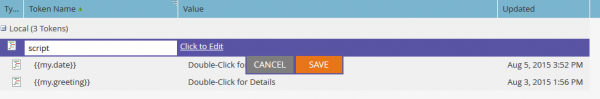

# Script e-mail

NOTA: si consiglia di leggere la [Guida utente Velocity](https://velocity.apache.org/engine/devel/user-guide.html) per approfondire il comportamento di Velocity Template Language.

[Apache Velocity](https://velocity.apache.org/) è un linguaggio basato su Java e progettato per la creazione di modelli e script di contenuti HTML. Marketo consente di utilizzarlo nel contesto delle e-mail utilizzando token di script. Questo consente di accedere ai dati memorizzati in Opportunità e Oggetti personalizzati e di creare contenuto dinamico nelle e-mail. Velocity offre un flusso di controllo standard di alto livello con if/else, for e for each per consentire la manipolazione condizionale e iterativa dei contenuti.

## Variabili

Le variabili hanno sempre il prefisso &#39;$&#39; e vengono impostate e aggiornate utilizzando il #set:

```
#set($variable = "value")
```

I loro valori possono quindi essere recuperati tramite diversi tipi di riferimento con comportamenti diversi:

```
$variable ##outputs 'value'
$variablename ##outputs '$variablename'
${variable}name ##outputs 'valuename'
```

Esiste anche una notazione di riferimento silenziosa, dove è presente un `!` Incluso dopo il `$`. Normalmente, quando Velocity incontra un riferimento non definito, la stringa che rappresenta il riferimento viene lasciata in posizione. Con la notazione di riferimento silenzioso, se viene rilevato un riferimento non definito, non viene emesso alcun valore:

```
##Defined Reference

#set($foo = "bar")
$foo ##outputs "bar"

##Undefined Reference

##normal
$baz ##outputs "$baz"

##quiet
$!baz ##outputs nothing
```

Per ulteriori informazioni su come fare riferimento alle variabili, consulta la [Guida utente di Apache](https://velocity.apache.org/engine/devel/user-guide.html#formal-reference-notation).

## Strumenti Velocity

Il progetto Apache Velocity rende disponibili le funzionalità tramite l&#39;utilizzo di [strumenti Velocity](https://velocity.apache.org/tools/devel/apidocs/overview-summary.html). Si tratta semplicemente di wrapper per oggetti Java ed espongono i loro metodi tramite variabili globali che sono rese disponibili a tutti gli script.

- [Strumento alternativo](https://velocity.apache.org/tools/devel/apidocs/org/apache/velocity/tools/generic/AlternatorTool.html)
- [ComparisonDateTool](https://velocity.apache.org/tools/devel/apidocs/org/apache/velocity/tools/generic/ComparisonDateTool.html)
- [Strumento di conversione](https://velocity.apache.org/tools/devel/apidocs/org/apache/velocity/tools/generic/ConversionTool.html)
- [Strumento data](https://velocity.apache.org/tools/devel/apidocs/org/apache/velocity/tools/generic/DateTool.html)
- [StrumentoVisualizzazione](https://velocity.apache.org/tools/devel/apidocs/org/apache/velocity/tools/generic/DisplayTool.html)
- [StrumentoMatematica](https://velocity.apache.org/tools/devel/apidocs/org/apache/velocity/tools/generic/MathTool.html)
- [NumberTool](https://velocity.apache.org/tools/devel/apidocs/org/apache/velocity/tools/generic/NumberTool.html)
- [StrumentoEsc](https://velocity.apache.org/tools/devel/apidocs/org/apache/velocity/tools/generic/EscapeTool.html)
- [StrumentoLoop](https://velocity.apache.org/tools/devel/apidocs/org/apache/velocity/tools/generic/LoopTool.html)

Ad esempio, per utilizzare un metodo di `ComparisonDateTool`, accedere se dalla variabile `$date` in un token di script:

```
#set($birthday = $convert.parseDate("2015-08-07","yyyy-MM-dd"))
##use whenIs to determine how many days away it is
$date.whenIs($birthday).days ##outputs 1
```

## Creazione di un token di script

Lo script Velocity viene incluso nelle e-mail utilizzando i token di script e-mail. Possono essere create nelle attività di marketing in una cartella di marketing o in un programma. Affinché un token possa essere utilizzato all’interno di un’e-mail, l’e-mail deve essere figlia di un programma che possiede il token o lo eredita da una cartella di marketing. Per creare un token, passare a una cartella o a un programma e selezionare la scheda [!UICONTROL My Tokens]. Dal menu di destra, trascina l’opzione &quot;Script e-mail&quot; nell’elenco dei token


Da qui, puoi modificare il nome del token e aprire l&#39;editor tramite l&#39;opzione [!UICONTROL Click to Edit]:



Una volta nell’editor, puoi creare uno script con accesso a tutte le variabili in oggetti accessibili da script. Per ottenere un riferimento di campo da un oggetto, trascinarlo dalla struttura di destra nello script:


## Incorporamento e test degli script

Una volta definito lo script all’interno di un token del programma, puoi farvi riferimento all’interno di una determinata e-mail utilizzando l’editor e-mail di Marketo.


Puoi testare lo script utilizzando l&#39;azione e-mail [!UICONTROL Send Sample Email] in E-mail Designer di Marketo. Affinché lo script possa essere elaborato correttamente, è necessario selezionare un lead esistente da rappresentare nel campo [!UICONTROL Lead]. Se si esegue il test con `$TriggerObject`, è possibile selezionare l&#39;oggetto di attivazione tramite il parametro [!UICONTROL Trigger]. Vengono utilizzati i dati dell&#39;oggetto aggiornato più di recente di quel tipo come variabile `$TriggerObject`.


È inoltre possibile utilizzare [!UICONTROL Email Preview] per testare lo script. A tale scopo, è necessario selezionare **[!UICONTROL View As: Lead Detail]** e selezionare un lead da un elenco statico disponibile. Ciò offre il vantaggio aggiuntivo di restituire eventuali eccezioni che possono essersi verificate durante l’esecuzione dello script:


## Suggerimenti utili

La lunghezza combinata di tutti i token di script e-mail in una determinata e-mail non può superare i 100.000 byte. Questo limite si riferisce alla lunghezza totale delle stringhe di token stesse (non alla lunghezza totale dopo l’espansione dei token).

- Le variabili a cui si fa riferimento nello script e-mail devono esistere in Marketo su uno degli oggetti disponibili per lo script.
- Puoi fare riferimento a oggetti personalizzati di primo e secondo livello provenienti dal CRM nativamente integrato che sono direttamente connessi al lead, o contatto, ma non a oggetti personalizzati di terzo livello. Gli oggetti personalizzati non possono essere padri del lead o della società
- Per gli oggetti personalizzati di Marketo, è possibile fare riferimento a oggetti personalizzati di secondo livello con relazione padre-figlio. Esempio: `Lead <- Parent <- Child`. Non è possibile fare riferimento a oggetti personalizzati di secondo livello con una relazione Edge-Bridge. Esempio: `Lead <- Bridge -> Edge`
- È possibile fare riferimento a oggetti personalizzati connessi a un lead, un contatto o un account, ma non a più di uno.
- È possibile fare riferimento agli oggetti personalizzati solo tramite una singola connessione, lead, contatto o account
- Devi selezionare la casella nell’editor di script per i campi in uso o che non verranno elaborati
- Per ogni oggetto personalizzato, i dieci record aggiornati più di recente per persona/contatto sono disponibili in fase di esecuzione e vengono ordinati dall’ultimo aggiornamento (a 0) a quello più recente (a 9). Puoi aumentare il numero di record disponibili di [seguendo le istruzioni](https://experienceleague.adobe.com/en/docs/marketo/using/product-docs/administration/email-setup/change-custom-object-retrieval-limits-in-velocity-scripting).
- Se includi più di uno script e-mail in un messaggio e-mail, questi vengono eseguiti dall’alto verso il basso. L’ambito delle variabili definite nel primo script da eseguire sarà disponibile negli script successivi.
- Riferimento strumenti: [https://velocity.apache.org/tools/2.0/index.html](https://velocity.apache.org/tools/2.0/index.html)
- Nota relativa ai token che contengono caratteri di nuova riga &quot;\\n&quot; o &quot;\\r\\n&quot;. Quando un’e-mail viene inviata tramite Invia campione o tramite una campagna batch, i caratteri di nuova riga nei token vengono sostituiti da spazi. Quando l’e-mail viene inviata tramite Trigger Campaign, i caratteri di nuova riga non vengono toccati.
- Per garantire la corretta analisi degli URL, l’intero percorso deve essere impostato come variabile e quindi stampato, e la variabile non deve essere stampata all’interno di riferimenti URL. Il protocollo (http:// o https://) deve essere incluso e separato dal resto dell’URL. L&#39;URL deve inoltre far parte di un tag di ancoraggio (<a>) completo. Per poter tenere traccia dei collegamenti, lo script deve generare un tag di ancoraggio completo. I collegamenti non vengono tracciati se vengono generati da un loop for o foreach.

```html
<!-- Correct -->
#set($url = "www.example.com/${object.id}")
<a href="http://${url}">Link Text</a>

<!-- Correct -->
<a href="http://www.example.com/${object.id}">Link Text</a>

<!-- Incorrect -->
<a href="${url}">Link Text</a>

<!-- Incorrect -->
<a href="{{my.link}}">Link Text</a>

<!-- Incorrect -->
<a href="http://{{my.link}}">Link Text</a>
```
