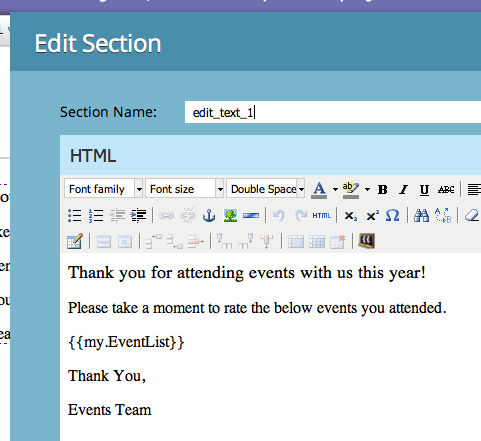
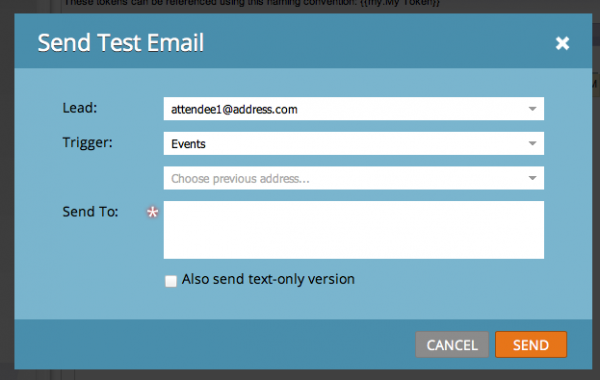

# Script e-mail

Per una spiegazione dettagliata del comportamento di Velocity Template Language, leggere la [Guida utente di Velocity](https://velocity.apache.org/engine/devel/user-guide.html).

[Apache Velocity](https://velocity.apache.org/) è un linguaggio basato su Java per la creazione di modelli e lo scripting di contenuti HTML. Utilizza Velocity nei token di script e-mail di Marketo per accedere ai dati memorizzati in opportunità e oggetti personalizzati e creare contenuti e-mail dinamici.

Velocity fornisce il flusso di controllo `if`/`else`, `for` e `foreach` per il contenuto condizionale e iterativo.

## Variabili

Prefisso variabili con `$`. Crea o aggiorna con `#set`:

```velocity
#set($variable = "value")
```

Recupera i valori delle variabili con tipi di riferimento che forniscono comportamenti diversi:

```text
$variable ##outputs 'value'
$variablename ##outputs '$variablename'
${variable}name ##outputs 'valuename'
```


La notazione di riferimento non interattiva include `!` dopo `$`. Per impostazione predefinita, Velocity lascia la stringa di riferimento in posizione quando un riferimento non è definito. Un riferimento silenzioso non emette alcun valore quando non è definito:

```velocity
##Defined Reference

#set($foo = "bar")
$foo ##outputs "bar"

##Undefined Reference

##normal
$baz ##outputs "$baz"

##quiet
$!baz ##outputs nothing
```

Per ulteriori informazioni su come fare riferimento alle variabili, consulta la [Guida utente di Apache](https://velocity.apache.org/engine/devel/user-guide.html#formal-reference-notation).

## Strumenti Velocity

Il progetto Apache Velocity fornisce [strumenti Velocity](https://velocity.apache.org/tools/devel/apidocs/overview-summary.html). Questi wrapper espongono i metodi dell&#39;oggetto Java tramite variabili globali disponibili per tutti gli script.

- [AlternatorTool](https://velocity.apache.org/tools/devel/apidocs/org/apache/velocity/tools/generic/AlternatorTool.html)
- [ComparisonDateTool](https://velocity.apache.org/tools/devel/apidocs/org/apache/velocity/tools/generic/ComparisonDateTool.html)
- [ConversionTool](https://velocity.apache.org/tools/devel/apidocs/org/apache/velocity/tools/generic/ConversionTool.html)
- [DateTool](https://velocity.apache.org/tools/devel/apidocs/org/apache/velocity/tools/generic/DateTool.html)
- [DisplayTool](https://velocity.apache.org/tools/devel/apidocs/org/apache/velocity/tools/generic/DisplayTool.html)
- [MathTool](https://velocity.apache.org/tools/devel/apidocs/org/apache/velocity/tools/generic/MathTool.html)
- [NumberTool](https://velocity.apache.org/tools/devel/apidocs/org/apache/velocity/tools/generic/NumberTool.html)
- [EscapeTool](https://velocity.apache.org/tools/devel/apidocs/org/apache/velocity/tools/generic/EscapeTool.html)
- [LoopTool](https://velocity.apache.org/tools/devel/apidocs/org/apache/velocity/tools/generic/LoopTool.html)

Per utilizzare ad esempio un metodo di `ComparisonDateTool`, accedere alla variabile `$date` in un token di script:

```velocity
#set($birthday = $convert.parseDate("2015-08-07","yyyy-MM-dd"))
##use whenIs to determine how many days away it is
$date.whenIs($birthday).days ##outputs 1
```

## Creazione di un token di script

Aggiungi script Velocity alle e-mail con token di script e-mail. Crea un token in Attività di marketing all’interno di una cartella di marketing o di un programma.

Per utilizzare un token, l’e-mail deve essere un elemento secondario del programma a cui appartiene il token o ereditarlo da una cartella di marketing. Passare a una cartella o a un programma e selezionare la scheda [!UICONTROL My Tokens]. Trascina l’opzione Script e-mail dal menu a destra nell’elenco dei token.


Modifica il nome del token, quindi seleziona [!UICONTROL Click to Edit] per aprire l&#39;editor:


Nell’editor, crea uno script che acceda alle variabili in oggetti accessibili da script. Per aggiungere un riferimento a un campo oggetto, trascinarlo dalla struttura destra allo script:


## Incorporamento e test degli script

Dopo aver definito lo script in un programma My Token, fai riferimento a esso da un’e-mail nell’editor e-mail di Marketo.



Verificare lo script con l&#39;azione [!UICONTROL Send Sample Email] nella finestra di progettazione e-mail di Marketo. Selezionare un lead esistente nel campo [!UICONTROL Lead] in modo che lo script venga elaborato correttamente.

Durante il test di `$TriggerObject`, selezionare l&#39;oggetto di attivazione con il parametro [!UICONTROL Trigger]. Marketo utilizza come variabile `$TriggerObject` l&#39;oggetto aggiornato più di recente di quel tipo.



È inoltre possibile eseguire il test con [!UICONTROL Email Preview]. Selezionare **[!UICONTROL View As: Lead Detail]**, quindi selezionare un lead da un elenco statico. L’anteprima mostra anche le eccezioni all’esecuzione dello script:


## Best practice

La lunghezza combinata di tutti i token di script e-mail in una determinata e-mail non può superare i 100.000 byte. Questo limite si riferisce alla lunghezza totale delle stringhe di token stesse (non alla lunghezza totale dopo l’espansione dei token).

- Le variabili a cui si fa riferimento nello script e-mail devono esistere in Marketo su uno degli oggetti disponibili per lo script.
- Puoi fare riferimento a oggetti personalizzati di primo e secondo livello provenienti dal CRM nativamente integrato che sono direttamente connessi al lead, o contatto, ma non a oggetti personalizzati di terzo livello. Gli oggetti personalizzati non possono essere padri del lead o della società
- Per gli oggetti personalizzati di Marketo, è possibile fare riferimento a oggetti personalizzati di secondo livello con relazione padre-figlio. Ad esempio `Lead <- Parent <- Child`. Non è possibile fare riferimento a oggetti personalizzati di secondo livello con una relazione Edge-Bridge. ad esempio, `Lead <- Bridge -> Edge`
- È possibile fare riferimento a oggetti personalizzati connessi a un lead, un contatto o un account, ma non a più di uno.
- È possibile fare riferimento agli oggetti personalizzati solo tramite una singola connessione, lead, contatto o account
- Seleziona la casella nell’editor di script per i campi in uso o che non vengono elaborati
- Per ogni oggetto personalizzato, sono disponibili in fase di esecuzione i dieci record aggiornati più di recente per persona/contatto. I record vengono ordinati dall&#39;ultimo aggiornamento dell&#39;indice 0 a quello più vecchio dell&#39;indice 9. Puoi aumentare il numero di record disponibili di [seguendo le istruzioni](https://experienceleague.adobe.com/en/docs/marketo/using/product-docs/administration/email-setup/change-custom-object-retrieval-limits-in-velocity-scripting).
- Se includi più di uno script e-mail in un messaggio e-mail, questi vengono eseguiti dall’alto verso il basso. L’ambito delle variabili definite nel primo script da eseguire è disponibile negli script successivi.
- Riferimento strumenti: [https://velocity.apache.org/tools/2.0/index.html](https://velocity.apache.org/tools/2.0/index.html)
- Nota relativa ai token che contengono caratteri di nuova riga &quot;\n&quot; o &quot;\r\n.&quot; Quando un’e-mail viene inviata tramite Invia campione o tramite una campagna batch, i caratteri di nuova riga nei token vengono sostituiti da spazi. Quando l’e-mail viene inviata tramite Trigger Campaign, i caratteri di nuova riga non vengono toccati.
- Per garantire la corretta analisi dell’URL, imposta il percorso completo come variabile, quindi stamparlo. Non stampare le variabili all’interno dei riferimenti URL. Includere il protocollo (`http://` o `https://`) separatamente dal resto dell&#39;URL. Generare un tag di ancoraggio completo (`<a>`) per consentire la registrazione dei collegamenti. L&#39;output dei collegamenti da un ciclo `for` o `foreach` non è tracciato.

```html
<!-- Correct -->
#set($url = "www.example.com/${object.id}")
<a href="http://${url}">Link Text</a>

<!-- Correct -->
<a href="http://www.example.com/${object.id}">Link Text</a>

<!-- Incorrect -->
<a href="${url}">Link Text</a>

<!-- Incorrect -->
<a href="{{my.link}}">Link Text</a>

<!-- Incorrect -->
<a href="http://{{my.link}}">Link Text</a>
```
