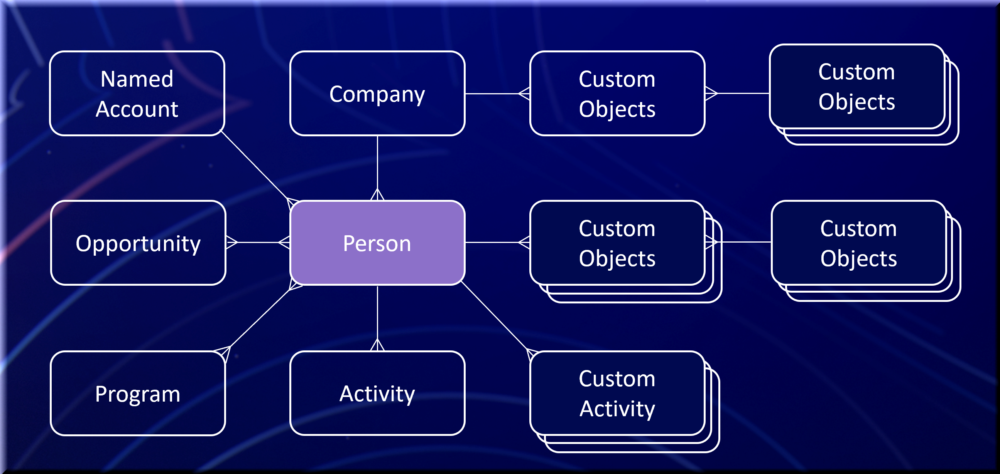

# Guida introduttiva

Marketo Engage è una piattaforma di automazione del marketing che consente agli addetti al marketing di gestire programmi e campagne multicanale personalizzati per clienti e potenziali clienti. La piattaforma di Marketo Engage può essere estesa utilizzando i punti di integrazione. Di seguito sono riportate le entità principali e le relative relazioni.

I seguenti oggetti non sono disponibili tramite API REST quando è abilitata la sincronizzazione nativa: Società, Opportunità, Ruolo opportunità, Venditore

## Persona (lead)

Le persone sono la base di qualsiasi piattaforma di automazione del marketing. In Marketo, tutti i record di persone non di vendita sono indicati come lead, indipendentemente dal fatto che siano designati come lead, potenziali clienti, sospetti, contatti e così via, dal punto di vista delle vendite. L&#39;oggetto lead viene fornito con un set di [campi standard](https://developer.adobe.com/marketo-apis/api/mapi/#tag/Leads/operation/getLeadFieldsUsingGET) quali e-mail, nome e cognome. È possibile aggiungere campi aggiuntivi al tipo di oggetto lead per estendere i tipi di informazioni associate ai record nel sistema. Gli attributi personalizzati possono essere letti e scritti come i campi standard. Un elenco completo dei campi è disponibile nel menu Marketo **[!UICONTROL Admin]** > **[!UICONTROL Field Management]**. I lead vengono identificati in modo univoco in Marketo dal campo ID. Altre chiavi univoche devono essere applicate esternamente dal sistema.

API correlate: [REST](https://developer.adobe.com/marketo-apis/api/mapi/#tag/Leads), [SOAP](soap-api/leads.md), [JavaScript](javascript-api/lead-tracking.md#lead-tracking-api)

## Attività

I lead interagiscono con la tua organizzazione in alcuni modi. Un lead può visitare una pagina del sito web della tua azienda, partecipare a una fiera o scaricare un whitepaper. Ognuna di queste azioni può essere acquisita in Marketo per aiutare un addetto al marketing a capire meglio quali attività ha svolto un lead e quando può coordinare comunicazioni tempestive e pertinenti. Le attività sono sempre correlate ai lead per leadId.

Puoi definire attività personalizzate. Dopo aver creato e pubblicato un’attività personalizzata, puoi aggiungere attività personalizzate tramite l’API Marketo. Ulteriori informazioni sulle attività personalizzate sono disponibili [qui](https://experienceleague.adobe.com/en/docs/marketo/using/product-docs/administration/marketo-custom-activities/understanding-custom-activities).

API correlate: [REST](https://developer.adobe.com/marketo-apis/api/mapi/#tag/Activities), [SOAP](soap-api/activities.md), [JavaScript](javascript-api/lead-tracking.md#munchkin-behavior)

## Programmi e campagne

Un programma è il meccanismo mediante il quale un addetto al marketing organizza tutti i diversi tipi di attività di marketing da una singola posizione centrale. Un esempio di programma è un’esplosione di un’e-mail. Un lead può intraprendere più azioni/attività correlate a un determinato programma che vengono associate al programma. Questa è nota come progressione del lead. Un esempio di progressione di un programma e-mail blast può registrare quando un lead riceve un’e-mail, quando la persona apre l’e-mail o se ha fatto clic su un collegamento nell’e-mail.

Le campagne vengono create per uno scopo specifico e un obiettivo specifico all’interno di un Programma. Un esempio di campagna potrebbe essere la limitazione di un gruppo di lead e l’invio dell’e-mail esplosiva, oppure la notifica a un rappresentante di vendita per il follow-up, se un lead fa clic su un collegamento all’interno del programma e-mail blast.

API correlate: [REST](https://developer.adobe.com/marketo-apis/api/mapi/#tag/Campaigns), [SOAP](soap-api/getcampaignsforsource.md)

## Tag

I tag sono un modo per raggruppare i dati a scopo di reporting. Questi identificatori consentono di categorizzare i dati e definire come creare rapporti sul programma per comprenderne l’efficacia e il ROI.

In qualità di amministratore di Marketo, puoi creare i tipi di tag obbligatori e facoltativi disponibili per la selezione quando un utente di Marketo crea un programma. I valori possibili per ciascuno di questi tipi di tag vengono definiti dall’utente e riflettono il modo in cui l’azienda desidera utilizzare i tag personalizzati a scopo di reporting.

Ad esempio, potrebbe essere utile creare un tipo di tag personalizzato &quot;Region&quot; con più valori di tag (ad esempio, Nordest, Southeast) per analizzare quale area genera il maggior numero di lead. Oppure, ad esempio, puoi creare un tipo di tag &quot;Proprietario&quot;, che ti consente di valutare e capire quali proprietari del programma (ad esempio, Maria, David o John) stanno avendo il maggiore impatto sulla creazione di lead e opportunità. Ulteriori informazioni sui tag sono disponibili [qui](https://experienceleague.adobe.com/en/docs/marketo/using/product-docs/core-marketo-concepts/programs/working-with-programs/understanding-tags).

API correlate: [REST](https://developer.adobe.com/marketo-apis/api/asset/), [SOAP](soap-api/gettags.md)

## Elenchi

Gli elenchi consentono a un addetto marketing di organizzare una raccolta di lead. In Marketo sono disponibili due tipi di elenchi: statico e intelligente. Un elenco statico è un elenco fisso di lead che un addetto marketing può aggiungere o rimuovere a sua scelta. Un elenco avanzato è una raccolta dinamica di lead basata su un insieme di caratteristiche designate. Un esempio di elenco avanzato potrebbe essere &quot;Tutti i lead che hanno visitato la pagina dei prezzi sul nostro sito Web&quot;. Questo elenco avanzato continua a crescere man mano che più lead visitano la pagina dei prezzi. Ulteriori informazioni sugli elenchi sono disponibili [qui](https://experienceleague.adobe.com/en/docs/marketo/using/home).

API correlate: [REST](https://developer.adobe.com/marketo-apis/api/asset/#tag/Static-Lists), [SOAP](soap-api/getimporttoliststatus.md)

## Opportunità

Gli addetti al marketing consegnano i lead per le vendite sotto forma di opportunità. Un&#39;opportunità rappresenta una potenziale opportunità di vendita ed è associata a un lead o a un contatto e a un&#39;organizzazione in Marketo. Un ruolo opportunità è l’intersezione tra un determinato lead e un’organizzazione. Il ruolo opportunità riguarda la funzione di un lead all’interno dell’organizzazione.

API correlate: [REST](https://developer.adobe.com/marketo-apis/api/mapi/#tag/Opportunities), [SOAP](soap-api/getmobjects.md)

## Aziende

Per organizzazione, a volte indicata come account in Marketo, si intende l’organizzazione a cui appartiene una persona. Quando si utilizza il reporting sul ROI in Marketo o Revenue Cycle Analytics (RCA), è importante associare le persone alla loro organizzazione e alle opportunità in modo da poter determinare la corretta attribuzione del ROI.

API correlate: [REST](https://developer.adobe.com/marketo-apis/api/mapi/#tag/Companies), [SOAP](soap-api/leads.md)

## Risorse

Assets rimanda a pagine di destinazione, e-mail, moduli e immagini utilizzati all’interno di un programma. Assets può essere locale per un determinato programma o globale. Le risorse globali sono disponibili per qualsiasi programma.

API correlate: [REST](https://developer.adobe.com/marketo-apis/api/asset/)

## Token

I token consentono a un addetto marketing di personalizzare i messaggi con le risorse e aggiungere logica all’interno delle azioni di flusso. Sono disponibili token per il sistema generale, i programmi, i lead e le aziende. Un esempio di token di lead è {{lead.First Name}}. Questo token può essere inserito all’interno di un’e-mail per visualizzare il nome del lead.

I token definiti a livello di programma o cartella sono denominati &quot;I miei token&quot; in Marketo. I miei token possono essere di tre tipi: locale, ereditato o sovrascritto.

I miei token creati localmente all’interno di una cartella o di un programma specifico della campagna sono disponibili per tale programma o cartella (locale). I miei token creati a livello di cartella della campagna sono disponibili per l’utilizzo in tutti i programmi contenuti nella cartella della campagna (ereditati). I token che vengono modificati a livello di programma con valori personalizzati non modificano il valore My Token padre del token a livello di cartella del programma (sostituito).

I miei token utilizzano la convenzione di denominazione {{my.My Token}}, with the word "my" added to the beginning of the token name. For example, if you create a Date type My Token with the name EventDate, the name of the token is {{my.EventDate}}. Ulteriori informazioni su I miei token sono disponibili [qui](https://experienceleague.adobe.com/en/docs/marketo/using/product-docs/core-marketo-concepts/programs/tokens/understanding-my-tokens-in-a-program).

API correlate: [REST](https://developer.adobe.com/marketo-apis/api/asset/#tag/Tokens), [SOAP](soap-api/getcampaignsforsource.md)

## Oggetti personalizzati

Un oggetto personalizzato Marketo consente di creare una relazione uno-a-molti o molti-a-molti (Edge-Bridge-Edge) tra i lead Marketo e i record oggetto personalizzati. Dopo aver creato e pubblicato un oggetto personalizzato di Marketo, puoi eseguire operazioni CRUD sull’oggetto personalizzato tramite l’API Marketo. Ulteriori informazioni sulla creazione di oggetti personalizzati sono disponibili [qui](https://experienceleague.adobe.com/en/docs/marketo/using/home). Quando si aggiungono nuovi record all&#39;oggetto personalizzato, è possibile utilizzare un trigger di elenco avanzato per rispondere. È inoltre possibile utilizzare i dati oggetto personalizzati come filtro negli elenchi avanzati (segmentazione) o nelle e-mail utilizzando [Script e-mail](email-scripting.md).

API correlate: [REST](https://developer.adobe.com/marketo-apis/api/mapi/#tag/Custom-Objects), [SOAP](soap-api/custom-objects.md)

## Venditori

I record persona di vendita e le relazioni lead possono essere gestiti in Marketo quando non è abilitata alcuna integrazione CRM nativa. Questi record contengono informazioni di base sulla persona di vendita, come Nome, E-mail e Qualifica, che possono essere utilizzate per filtrare e token in Marketo quando un lead è di proprietà di uno di essi. La relazione con un venditore viene gestita a livello di lead tramite il campo &quot;externalSalesPersonId&quot;, che deve essere aggiornato tramite l&#39;API [Sync Leads](https://developer.adobe.com/marketo-apis/api/mapi/#tag/Leads/operation/syncLeadUsingPOST).

API correlate: [REST](https://developer.adobe.com/marketo-apis/api/mapi/#tag/Sales-Persons)
