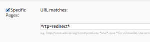

# Reindirizza

Utilizza l’API di reindirizzamento RTP per inviare segmenti di pubblico a un URL di destinazione.

- Prima di utilizzare l&#39;API Contesto utente, è necessario essere un cliente di Web Personalization e disporre del tag [RTP distribuito](https://experienceleague.adobe.com/en/docs/marketo/using/product-docs/web-personalization/rtp-tag-implementation/deploy-the-rtp-javascript) sul sito.
- RTP non supporta gli elenchi di account denominati Account Based Marketing (Marketing basato su account). Gli elenchi e il codice ABM si riferiscono solo agli elenchi di account caricati (file CSV) gestiti all’interno di RTP.

## Utilizzo

`rtp('send' , 'redirect' , 'field_name' , [ 'values_array' , '...' , '...' ] , 'www.redirect_url.com' , true/false )`

| Parametro | Facoltativo/Obbligatorio | Tipo | Descrizione |
| --- | --- | --- | --- |
| &#39;invia&#39; | Obbligatorio | Stringa | Azione del metodo. |
| &#39;reindirizza&#39; | Obbligatorio | Stringa | Nome del metodo. |
| nome_campo | Obbligatorio | Stringa | Nome del campo da confrontare. Esempio: &quot;abm.name&quot; (vedi sotto). |
| matrice_valori | Obbligatorio | Array | Elenco di valori con cui confrontare il campo (senza distinzione maiuscole/minuscole). |
| redirect_url | Obbligatorio | Stringa | URL di destinazione per reindirizzare i visitatori che corrispondono alla condizione. |
| redirect_matched_visitors | Facoltativo | Booleano | Se true, i visitatori con la condizione corrispondente verranno reindirizzati. Se false, i visitatori senza corrispondenza vengono reindirizzati. Impostazione predefinita: true. |

Le condizioni di reindirizzamento possono utilizzare l’organizzazione, il settore, gli elenchi ABM, la posizione, l’ISP o i segmenti corrispondenti.

| Condizione | Gerarchia dei dati | Esempio |
| --- | --- | --- |
| Segmenti corrispondenti (funziona solo dopo il primo clic) | matchedSegments.name | rtp( &#39;send&#39;, &#39;redirect&#39; , &#39;matchedSegments.name&#39; , [&#39;Fortune 1,000&#39; , &#39;Enterprise&#39;] , &#39;<https://www.example.com>&#39;); |
| Segmenti corrispondenti (funziona solo dopo il primo clic) | matchedSegments.id | rtp( &#39;send&#39;, &#39;redirect&#39; , &#39;matchedSegments.id&#39; , [106 , 107 , 190] , &#39;<https://www.example.com>&#39;); |
| Elenchi ABM | abm.name | rtp( &#39;send&#39;, &#39;redirect&#39; , &#39;abm.name&#39; , [&#39;top_key_accounts&#39;, &#39;active_customers&#39;] , &#39;<https://www.example.com>&#39;); |
| Elenchi ABM | abm.code | rtp( &#39;send&#39;, &#39;redirect&#39; , &#39;abm.code&#39; , [13 , 15] , &#39;<https://www.example.com>&#39;); |
| Organizzazioni | org | rtp( &#39;send&#39;, &#39;redirect&#39; , &#39;org&#39;, [&#39;ebay&#39;], &#39;<https://www.example.com>&#39;); |
| Posizione | location.country | rtp( &#39;send&#39;, &#39;redirect&#39; , &#39;location.country&#39; , [&#39;Stati Uniti&#39;], &#39;<https://www.example.com>&#39;); |
| Posizione | location.state | rtp( &#39;send&#39;, &#39;redirect&#39; , &#39;location.state&#39;, [&#39;ca&#39;], &#39;<https://www.example.com>&#39;); |
| Posizione | location.city | rtp( &#39;send&#39;, &#39;redirect&#39; , &#39;location.city&#39;, [&#39;San Mateo&#39;], &#39;<https://www.example.com>&#39;); |
| Settori | settori | rtp( &#39;send&#39;, &#39;redirect&#39; , &#39;industrie&#39; , [&#39;Istruzione&#39;], &#39;<https://www.example.com>&#39;); |
| ISP | isp | rtp( &#39;send&#39;, &#39;redirect&#39; , isp , [&#39;False&#39;], &#39;<https://www.example.com>&#39;); |

## Note

- Per ridurre la latenza per un reindirizzamento basato su elementi Firmografici, ad esempio azienda, settore o posizione, inserisci il codice di reindirizzamento prima di rtp(&#39;send&#39;, &#39;view&#39;) e rtp(&#39;get&#39;,&#39;campaign&#39;).
- Inserisci il codice di reindirizzamento immediatamente dopo il tag rtp nell’intestazione della pagina.
- Ottimizza il caricamento del sito web per migliorare la velocità del reindirizzamento JavaScript lato browser.
- Evita i reindirizzamenti automatici. rtp include una protezione che blocca le chiamate di reindirizzamento ciclico.

```html
<!DOCTYPE html>
<html lang="en-US">
<head>
<!-- RTP tag -->
<script type='text/javascript'>

// This tag needs to be replaced with your account tag
(function(c,h,a,f,i){c[a]=c[a]||function(){(c[a].q=c[a].q||[]).push(arguments)};
c[a].a=i;var g=h.createElement("script");g.async=true;g.type="text/javascript";
g.src=f+'?rh='+c.location.hostname+'&aid='+i;var b=h.getElementsByTagName("script")[0];b.parentNode.insertBefore(g,b);
})(window,document,"rtp","//xyz.marketo.com/rtp-api/v1/rtp.js","xyz");

// START REDIRECT EXAMPLE
//   - Using a helper redirect function
//   - Redirect based on named account
rtp('send','redirect','org', ['microsoft'],'http://www.marketo.com');

// Redirect based on named account list (ABM)
rtp('send','redirect','abm.name', {
    // Redirect visitors that match 'first_abm' list to www.marketo.com
    'http://www.marketo.com' : ['first_abm'],
    // Redirect visitors that match 'second_abm' list to blog.marketo.com
    'http://blog.marketo.com' : ['second_abm']
});
// END REDIRECT EXAMPLE
rtp('send','view');
rtp('get','campaign');
</script>
<!-- End of RTP tag -->
```

## Reindirizzare i visitatori tracciati

1. Aggiungi il parametro all’URL di destinazione, ad esempio &lt;www.marketo.com?rtp=redirect>.
1. Crea un segmento denominato &quot;Reindirizzato da RTP&quot;.
1. Utilizza il parametro &quot;Pagine specifiche&quot; per eseguire il targeting dei visitatori che visualizzano una pagina che contiene il parametro.



## Come definire più di una condizione con URL di destinazione diversi

La chiamata di reindirizzamento supporta più chiamate. Utilizza più chiamate per combinare campi e creare condizioni con URL e valori diversi.

### Utilizzo

`rtp('send', 'redirect', field_name, url_values_map);`

| Parametro | Facoltativo/Obbligatorio | Tipo | Descrizione |
| --- | --- | --- | --- |
| &#39;invia&#39; | Obbligatorio | Stringa | Azione del metodo. |
| &#39;reindirizza&#39; | Obbligatorio | Stringa | Nome del metodo. |
| nome_campo | Obbligatorio | Stringa | Nome del campo da confrontare. Esempio: &quot;abm.name&quot; (vedi sopra). |
| url_values_map | Obbligatorio | Oggetto | Mappa tra l’URL di reindirizzamento e l’elenco di valori. Esempio:{&#39;<https://www.example.com>&#39; : [&#39;first_abm&#39;, &#39;second_abm&#39;]} |

#### Esempio

```javascript
rtp('send','redirect','abm.name', {
    // Redirect visitors that match 'first_abm' list to www.marketo.com
    'http://www.marketo.com' : ['first_abm'],
    // Redirect visitors that match 'second_abm' list to blog.marketo.com
    'http://blog.marketo.com' : ['second_abm']
});
rtp('send','redirect','org', {
    // Redirect visitors from 'Microsoft' to www.marketo.com/enterprise
    'http://www.marketo.com/enterprise' : ['microsoft']
});
```
