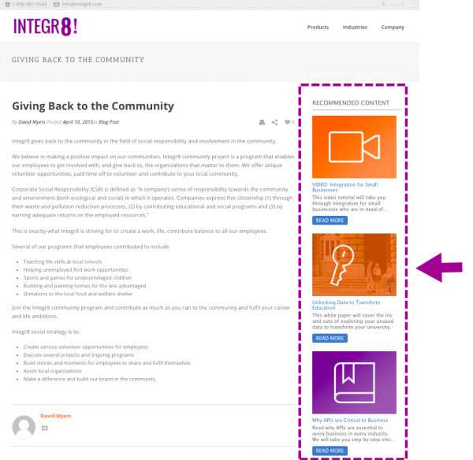

# Consigli per contenuti multimediali avanzati

Per visualizzare un modello per consigli su contenuti multimediali avanzati, aggiungi alla pagina i tag e le chiamate API richiesti.

1. Nell’intestazione della pagina:
   1. Installa il tag RTP.
   1. Aggiungi la chiamata GET che popola i consigli.
   1. Aggiungi la chiamata SET che configura il modello.
1. Nel corpo della pagina:
   1. Posizionare il tag del modello (classe div) nel punto in cui si desidera visualizzare il modello.

Per ulteriori informazioni, vedere [Abilitare Predictive Content for Web Rich Media](https://experienceleague.adobe.com/it/docs/marketo/using/product-docs/predictive-content/enabling-predictive-content/enable-predictive-content-for-web-rich-media).

## Tag modello

| Attributo | Facoltativo/Obbligatorio | Descrizione |
| --- | --- | --- |
| classe | Obbligatorio | Identifica l’elemento div HTML come div di consigli RTP. |
| data-rtp-template-id | Obbligatorio | Determina l’allineamento dei consigli. Utilizzare &quot;template1&quot; per l&#39;allineamento orizzontale, &quot;template2&quot; per l&#39;allineamento verticale o &quot;template3&quot; per l&#39;allineamento verticale con solo un titolo e una descrizione. Lo script inserisce il modello corrispondente in `div`. Valori consentiti: template1, template2, template3. |

### Esempi

Utilizza &quot;template1&quot; per visualizzare i consigli in orizzontale.

```html
<div class="RTP_RCMD2" data-rtp-template-id="template1"></div>
```

Utilizza &quot;template2&quot; per visualizzare i consigli in verticale.

```html
<div class="RTP_RCMD2" data-rtp-template-id="template2"></div>
```

Utilizza &quot;template3&quot; per visualizzare i consigli in verticale con solo un titolo e una descrizione.

```html
<div class="RTP_RCMD2" data-rtp-template-id="template3"></div>
```

Vedi gli esempi di allineamento del modello [&#128279;](#example_of_rich_media_recommendation_template_1).

## Popolare consiglio

Questo metodo popola tutti i rich media `<divs>` sulla pagina con i consigli.

### Utilizzo

`rtp('get', 'rcmd', 'richmedia');`

| Parametro | Facoltativo/Obbligatorio | Tipo | Descrizione |
| --- | --- | --- | --- |
| &#39;get&#39; | Obbligatorio | Stringa | Azione del metodo. |
| &#39;rcmd&#39; | Obbligatorio | Stringa | Nome del metodo. |
| &#39;richmedia&#39; | Obbligatorio | Stringa | Nome del metodo secondario. |

## Cambia configurazione modello

Questo metodo modifica la configurazione predefinita del modello.

Chiama questo metodo prima di chiamare rtp(&#39;get&#39;,&#39;rcmd&#39;, &#39;richmedia&#39;);

### Utilizzo

`rtp('set', 'rcmd', 'richmedia', 'template_id', conf_obj);`

| Parametro | Facoltativo/Obbligatorio | Tipo | Descrizione |
| --- | --- | --- | --- |
| &#39;set&#39; | Obbligatorio | Stringa | Azione del metodo. |
| &#39;rcmd&#39; | Obbligatorio | Stringa | Nome del metodo. |
| &#39;richmedia&#39; | Obbligatorio | Stringa | Nome del metodo secondario. |
| template_id | Facoltativo | Stringa | ID modello per le modifiche alla configurazione. Consente di specificare la modifica delle impostazioni per un solo modello. |
| conf_obj | Obbligatorio | Oggetto | La nuova configurazione. L&#39;oggetto contiene tutte le configurazioni come coppia chiave/valore. |

### Esempi

In questo esempio viene modificato il testo del titolo di un modello.

```javascript
rtp("set", "rcmd", "richmedia","template1",
    {
        "rcmd.title.text": "RECOMMENDED CONTENT"
    }
);
```

In questo esempio vengono impostate le categorie e le proprietà di configurazione multiple per un modello.

```javascript
rtp("set", "rcmd", "richmedia",
    {
        "template1":
        {
            "rcmd.title.text": "RECOMMENDED CONTENT",
            "rcmd.general.font.family": "arial",
            "category":
            [
                "webinar",
                "blog posts",
                "pricing_page_category",
                "product_a_category"
            ]
        }
    }
);
```

Utilizza &quot;categoria&quot; per filtrare il contenuto visualizzato nei consigli sui contenuti predittivi. Per utilizzare il contenuto predittivo per tutto il contenuto abilitato, lascia vuota la voce &quot;categoria&quot;.

Per consigliare solo contenuti specifici nel modello Rich Media, aggiungi una categoria per il contenuto nella pagina Imposta contenuto. Quindi associa tale categoria al codice del modello di consigli. Ad esempio, categorizza i contenuti rilevanti in base alle sezioni di prodotto o soluzione del sito web.

In questo esempio vengono impostate più proprietà di configurazione per un modello.

```javascript
rtp("set", "rcmd", "richmedia",
    {
        "template1":
        {
            "rcmd.title.text": "RECOMMENDED CONTENT",
            "rcmd.general.font.family": "arial"
        }
    }
);
```

#### Proprietà di configurazione

| Configurazione | Esempio | Descrizione |
| --- | --- | --- |
| rcmd.general.font.family | &quot;rcmd.general.font.family&quot; : &quot;arial&quot; | Modifica la famiglia di caratteri per tutto il testo del modello. Questa proprietà supporta tutti i valori CSS per tipo di browser. È possibile utilizzare una famiglia di caratteri personalizzata se esiste nella pagina. |
| rcmd.content.background.color | &quot;rcmd.content.background.color&quot; : &quot;black&quot; | Modifica il colore di sfondo delle caselle interne del modello. Questa proprietà supporta tutti i valori CSS per tipo di browser. |
| rcmd.title.text | &quot;rcmd.title.text&quot; : &quot;CONTENUTO CONSIGLIATO&quot; | Modifica il titolo del modello. |
| rcmd.title.background.color | &quot;rcmd.title.background.color&quot; : &quot;blue&quot; | Modifica il colore di sfondo della casella del titolo. Questa proprietà supporta tutti i valori di colore css (nome colore, rgb, ...) |
| rcmd.title.font.size | &quot;rcmd.title.font.size&quot; : &quot;26px&quot; | Modifica la dimensione del carattere del titolo. La proprietà supporta tutte le possibili dimensioni di carattere del valore CSS (px, em, ...) |
| rcmd.title.font.color | &quot;rcmd.title.font.color&quot; : &quot;white&quot; | Cambia il colore del carattere del titolo. Questa proprietà supporta tutti i valori dei colori dei caratteri (rgb, hex, ...) |
| rcmd.description.font.color | &quot;rcmd.description.font.color&quot; : &quot;white&quot; | Cambia il colore del carattere della descrizione. Questa proprietà supporta tutti i valori dei colori dei caratteri (rgb, hex, ...) |
| rcmd.cta.background.color | &quot;rcmd.cta.background.color&quot; : &quot;green&quot; | Cambia il colore di sfondo del pulsante. Questa proprietà supporta tutto il valore del colore CSS (nome colore, rgb, ...) |
| rcmd.cta.font.color | &quot;rcmd.cta.font.color&quot; : &quot;rgb(90, 84, 164)&quot; | Cambia il colore del carattere del pulsante. Questa proprietà supporta tutti i valori dei colori dei caratteri (rgb, hex, ...) |
| rcmd.cta.text | &quot;rcmd.cta.text&quot;: &quot;Push&quot; | Modifica il testo del pulsante. Il testo è lo stesso per tutti i pulsanti. |
| categoria | &quot;categoria&quot;: [&quot;una categoria&quot;] | Modifica la categoria di consigli supportata dal modello. Il modello visualizza solo i consigli con una delle categorie impostate da questa configurazione. |

Il supporto della configurazione può variare a seconda del modello.

#### Esempio di base

In questo esempio vengono visualizzati tre consigli in un modello. Copiare l&#39;esempio in una pagina HTML e quindi sostituire il tag RTP con il tag.

```html
<!DOCTYPE>
<html>
<head>
<meta http-equiv="Content-Type" content="text/html; charset=UTF-8">
<title>RTP recommendation</title>
<!-- RTP tag -->
<script type='text/javascript'>

// This tag needs to be replaced with your account tag
(function(c,h,a,f,i,e){c[a]=c[a]||function(){(c[a].q=c[a].q||[]).push(arguments)};
c[a].a=i;c[a].e=e;var g=h.createElement("script");g.async=true;g.type="text/javascript";
g.src=f+'?aid='+i;var b=h.getElementsByTagName("script")[0];b.parentNode.insertBefore(g,b);
})(window,document,"rtp","//example.rtp.com/rtp-api/v1/rtp.js","account_id");

// Send page view (required by  the recommendation)
rtp('send','view');
// Populate recommendation
rtp('get','rcmd', 'richmedia');
</script>
<!-- End of RTP tag -->
</head>
<body>
<div class="RTP_RCMD2" data-rtp-template-id="template1"></div>
</body>
</html>
```

#### Esempio avanzato

In questo esempio vengono visualizzati tre consigli in un modello. Il titolo del modello è &quot;CONTENUTO CONSIGLIATO&quot; e il testo del pulsante è &quot;Ulteriori informazioni&quot;. Copiare l&#39;esempio in una pagina HTML e quindi sostituire il tag RTP con il tag.

```html
<!DOCTYPE>
<html>
<head>
<meta http-equiv="Content-Type" content="text/html; charset=UTF-8">
<title>RTP recommendation</title>
<!-- RTP tag -->
<script type='text/javascript'>

// This tag needs to be replaced with your account tag
(function(c,h,a,f,i,e){c[a]=c[a]||function(){(c[a].q=c[a].q||[]).push(arguments)};
c[a].a=i;c[a].e=e;var g=h.createElement("script");g.async=true;g.type="text/javascript";
g.src=f+'?aid='+i;var b=h.getElementsByTagName("script")[0];b.parentNode.insertBefore(g,b);
})(window,document,"rtp","//example.rtp.com/rtp-api/v1/rtp.js","account_id");

// Send page view (required by  the recommendation)
rtp('send','view');
// Populate the recommendation zone
rtp('get', 'campaign',true);
// Change template configuration
rtp('set', 'rcmd', 'richmedia',
    {
        template1 :
        {
            "rcmd.title.text" : "RECOMMENDED CONTENT",
            "rcmd.cta.text" : "Read More"
        }
    }
);
// Populate recommendation
rtp('get','rcmd', 'richmedia');
</script>
<!-- End of RTP tag -->
</head>
<body>
<div class="RTP_RCMD2" data-rtp-template-id="template1"></div>
</body>
</html>
```

#### Esempio di #1 del modello di consigli per contenuti multimediali avanzati

**Nome**: modello1

**Descrizione**: contenuto orizzontale che include un&#39;immagine, un titolo, una descrizione e un pulsante call-to-action.


#### Esempio di #2 del modello di consigli per contenuti multimediali avanzati

**Nome**: modello2

**Descrizione**: contenuto verticale che include un&#39;immagine, un titolo, una descrizione e un pulsante call-to-action.



#### Esempio di #3 del modello di consigli per contenuti multimediali avanzati

**Nome**: modello3

**Descrizione**: contenuto verticale che include solo un titolo e una descrizione. Al passaggio del mouse, l’intestazione cambia colore e si collega all’URL del contenuto. La descrizione consente inoltre di collegare il contenuto senza modificare il colore.


