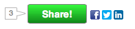

# Social

[Social marketing Marketo](https://business.adobe.com/products/marketo/social-marketing.html) consente agli addetti al marketing di incorporare widget social all’interno di siti web e pagine di destinazione. I widget per social network includono sondaggi, pulsanti di condivisione social, video, ritocchi e promozioni come offerte di riferimento.

## Esempio di widget di condivisione incorporato

```html
<!-- Marketo Widget Loader Script --> 

<script type="text/javascript" src="//b2c-mlm.marketo.com/jsloader/271d8232-1500-4305-b7ed-05d451b9ee0c/loader.php.js">
</script>

 <!-- The Location of the Social Widget --> 

<divclass='cf_widgetloader cf_w_245d8f3c0955454cbd26abc39d0d874c'="" options="{&quot;outerHeight&quot;:400, &quot;outerWidth&quot;:600}">
</divclass='cf_widgetloader'>
```



Esistono due metodi di base per personalizzare un widget social:

1. Utilizzare la normale interfaccia utente del prodotto e allegare i listener di eventi per essere informati quando si sono verificate determinate azioni nell’interfaccia utente al fine di eseguire una logica di business aggiuntiva.
1. Sostituzione della normale interfaccia utente del prodotto con una personalizzata e attivazione delle &quot;fasi&quot; a comparsa dell’interfaccia utente, se necessario.

## Associazione di eventi all’interfaccia utente normale

Esistono due modi per abbonarsi agli eventi nella libreria JavaScript CF, a livello globale, o per un singolo widget. Gli eventi sono documentati di seguito nella tabella degli eventi.

### Iscrizione evento globale

```html
<script>
cf_scripts.afterload(function(){
    CF.events.listen("event_name_here",
        function(event, arg1){
            //Your code to do something on the event goes here.
            //It will be fired whenever ANY widget fires the event "event_name_here".
        }
    );
});
</script>
```

### Sottoscrizione evento per widget

```html
<script>
cf_scripts.afterload(function(){
    CF.widget.listen("widget_name_here", "event_name_here",
        function(event, arg1){
            //Your code to do something on the event goes here.
            //It will be fired whenever the widget named "widget_name_here" fires the event "event_name_here".
        }
    );
});
</script>
```

## Un esempio

Questo esempio mostra un elemento precedentemente nascosto con ID &quot;signedUp&quot; dopo che un utente ha completato la registrazione di un’offerta per un widget denominato &quot;referral_SignUp&quot;.

```html
<div id='signedUp'style='display:none; color:green;'>This is a custom message to let you know that you signed up!</div>
<div class='cf_widgetLoader cf_w_referral_SignUp'></div>

<script>
    cf_scripts.afterload(function(){
        CF.widget.listen("referral_SignUp", "offer_enrolled", function(){
        cf_jq("#signedUp").show();
    });
});
</script>
```

## Tabella eventi di base

| Nome evento | Descrizione | Widget che utilizzano questo evento | Argomenti supportati (passati alla funzione di callback dell’evento) |
| --- | --- | --- | --- | 
| share_sent | Viene attivato ogni volta che una richiesta di condivisione viene inviata al server per l&#39;elaborazione | Tutti i widget che possono condividere | 1.&quot;share_sent&quot; (Stringa)<br>2. Parametri inviati (oggetto) |
| share_success | Generato quando la richiesta di condivisione viene elaborata correttamente. | Tutti i widget che possono condividere. | 1.&quot;share_success&quot; (stringa)<br>2. Condividi oggetto di risposta, contenente il messaggio inviato e l’URL abbreviato (oggetto) |
| voting_success | Generato quando un utente ha votato correttamente in un sondaggio. | Sondaggio, VS, widget voto | 1. &quot;voting_success&quot; (Stringa)<br>2. Elemento votato, incluso titolo, descrizione, identificatore entità (oggetto) |
| offer_enrollers | Generato quando un utente si è iscritto correttamente a un’offerta | Tutti i widget di offerta | 1.&quot;offer_enrollers&quot; (Stringa)<br>2. Proprietà utente modificate (oggetto),<br>3. Attributi utente modificati (oggetto) |
| profile_saved | Generato quando un utente aggiorna il proprio profilo dall’acquisizione del profilo | Tutti i widget non di offerta per i quali è abilitata l’acquisizione del profilo | 1.&quot;profile_saved&quot; (stringa)<br>2. Proprietà utente modificate (oggetto)<br>3. Attributi utente modificati (oggetto) |
| video_loaded | Generato quando un video incorporato è completamente caricato e inizializzato. | Widget Condivisione video | 1. &quot;video_loaded&quot; (Stringa) 2. Elemento &quot;.cf_videoshare_wrap&quot; che contiene il video (jQuery Object) |

## Sostituzione dell’interfaccia utente con un’interfaccia personalizzata

Per sostituire l’interfaccia con un’interfaccia personalizzata, devi prima disattivare l’interfaccia normale, impostando l’opzione _popupUIOnly_ a _true_. Con questa opzione impostata, l&#39;interfaccia utente standard non eseguirà il rendering al caricamento della pagina, ma il widget recupera i dati e attende che tu avvii una delle sue fasi a comparsa chiamando _CF.widget.activate_ e fornendo opzioni per ciò che dovrebbe fare.

Di seguito è riportato un esempio di creazione di un pulsante personalizzato che avvia il flusso di iscrizione a un’offerta di riferimento per un widget di offerta di riferimento denominato _referral_SignUp_.

```html
<button id="myNewSignUpButton">My newSign Up button</button>

<!-- Turn off the defaultreferral offer UI by setting popupUIOnly to true-->
<div class="cf_widgetLoader cf_w_referral_SignUp" options="{popupUIOnly:true}"></div>

<script>
cf_scripts.afterload(function($, CF){
    // After the cf script library has loaded, find the button with
    // id="myNewSignUpButton", and attach a click listener to it.
    $("#myNewSignUpButton").click(function(){
        // When it is clicked, activate the popup widget flow for the referral,
        // asking it to point to the clicked button.
        CF.widget.activate("referral_SignUp", {pointTo:$(this)});
    });
});
</script>
```

Poiché l&#39;aggiunta di gestori di clic è comune, esiste un metodo di scelta rapida per aggiungerli. Quanto segue è equivalente dal punto di vista funzionale all’esempio precedente.

```html
<button id="myNewSignUpButton">My newSign Up button</button>
<div class="cf_widgetLoader cf_w_referral_SignUp" options="{popupUIOnly:true}"></div>

<script>
cf_scripts.afterload(function($, CF){
    // Use the addClickActivate convenience method, which will
    // automatically make the popup point at the clicked item with id myNewSignUpButton.
    CF.widget.addClickActivate("#myNewSignUpButton", "referral_SignUp", {});
});
</script>
```

## Recupero dei dati dell’interfaccia utente del widget da inserire nell’interfaccia utente sostitutiva

Se hai bisogno di dati sul widget per disegnare l&#39;interfaccia utente sostitutiva, puoi ottenere i dati dall&#39;evento speciale _ui_data_. È possibile ascoltare questo evento con il normale `CF.widget.listen` ma questa operazione può causare una potenziale situazione di tipo &quot;race condition&quot;, in cui il listener di eventi viene aggiunto dopo che il widget ha già attivato l’evento_ui_data_, impedendo la ricezione di dati. Per evitare questa corsa, utilizzare il `CF.widget.uiData_ method instead, which will give you the most recent available _ui_data_, and listen for all future updates as well. The _ui_data` viene attivato ogni volta che viene eseguita un&#39;azione che avrebbe causato la ridefinizione dell&#39;interfaccia utente standard del widget, anche se l&#39;interfaccia utente è stata disabilitata con `popupUIOnly` opzione.

Un esempio che utilizza `uiData` funzione per visualizzare il numero di voci di un utente per una sweepstakes con nome widget _sweeps_Sweepstakes_.

```html
<span>You have <span id="entryCount">?</span> entries.</span>

<div class="cf_widgetLoader cf_w_sweeps_Sweepstakes"></div>

<button id='myNewSweepsButton'>New Sweeps Up Button!</button>

<script>
cf_scripts.afterload(function($, CF){
    CF.widget.uiData("sweeps_Sweepstakes", function(uiData){
        if(uiData.user && uiData.userStatus && uiData.userEntries){
            $("entryCount").html(""+ uiData.userEntries);
        }
        else{
            $("entryCount").html("0");
        }
    });
});
</script>
```

## Riferimento dati dell’interfaccia utente per l’abbonamento all’offerta di riferimento

| Tipo | Descrizione |
|---------------|----------------------------------------------------|
| data | Valore data del modulo &quot;aaaa-MM-gg&quot; |
| numero | Numero intero o a virgola mobile |
| testo RTF | Una stringa HTML |
| punteggio | Un numero intero a 32 bit con segno |
| campagna sfdc | Utilizzato nell’integrazione della gestione delle campagne Salesforce |
| text | Una stringa di testo |

## Riferimento per i dati dell’interfaccia utente di TrackProgress dell’offerta di riferimento

| Tipo | Descrizione |
|---------------|----------------------------------------------------|
| data | Valore data del modulo &quot;aaaa-MM-gg&quot; |
| numero | Numero intero o a virgola mobile |
| testo RTF | Una stringa HTML |
| punteggio | Un numero intero a 32 bit con segno |
| campagna sfdc | Utilizzato nell’integrazione della gestione delle campagne Salesforce |
| text | Una stringa di testo |

## Riferimenti dei dati nell’interfaccia utente di Sweepstakes (per gli Sweepstakes delle campagne social, non per gli Sweepstakes LM)

| Tipo | Descrizione |
|---------------|----------------------------------------------------|
| data | Valore data del modulo &quot;aaaa-MM-gg&quot; |
| numero | Numero intero o a virgola mobile |
| testo RTF | Una stringa HTML |
| punteggio | Un numero intero a 32 bit con segno |
| campagna sfdc | Utilizzato nell’integrazione della gestione delle campagne Salesforce |
| text | Una stringa di testo |

## Riferimento dati accesso social network (widget riempimento modulo)

| Tipo | Descrizione |
|---------------|----------------------------------------------------|
| data | Valore data del modulo &quot;aaaa-MM-gg&quot; |
| numero | Numero intero o a virgola mobile |
| testo RTF | Una stringa HTML |
| punteggio | Un numero intero a 32 bit con segno |
| campagna sfdc | Utilizzato nell’integrazione della gestione delle campagne Salesforce |
| text | Una stringa di testo |

```javascript
{
"alt_id": "http://www.facebook.com/profile.php?id=1526228678",
"provider_name": "facebook",
"default_photo_url": "https://graph.facebook.com/1526228678/picture?type=large",
"email": "ian.b.taylor@gmail.com",
"verified_email": "ian.b.taylor@gmail.com",
"gender": "male",
"preferred_user_name": "IanTaylor",
"display_name": "Ian Taylor",
"birth_date": 343954800000,
"first_name": "Ian",
"last_name": "Taylor",
"city": null,
"state": null,
"region": null,
"postal_code": null,
"country": null,
"time_zone": null,
"connection_count": 0,
"credentials": {
"uid": "1526228678",
"scopes": "publish_actions",
"expires": "1371994082",
"accessToken": "BAAGFJ0KUFpcBABuNMptmYY...",
"type": "Facebook"
},
"about_me": null,
"cur_pos_title": "Senior Staff Engineer",
"phone_number": null,
"company": "Marketo",
"cur_pos_start_date": 1333231200000,
"cur_pos_summary": null
}
```
