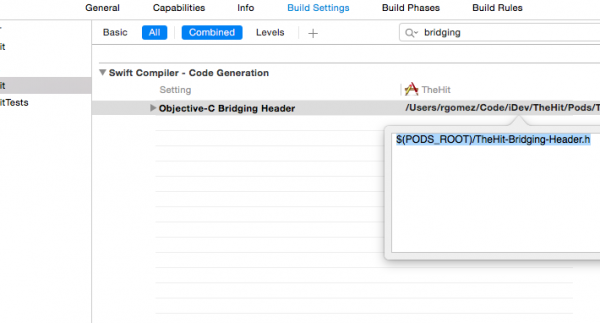

# Installazione

Istruzioni di installazione per Marketo Mobile SDK. I passaggi seguenti sono necessari per inviare notifiche push e/o messaggi in-app.

## Installare Marketo SDK su iOS

### Prerequisiti

1. [Aggiungi un&#39;applicazione in Marketo Admin](https://experienceleague.adobe.com/en/docs/marketo/using/product-docs/mobile-marketing/admin/add-a-mobile-app) (ottieni la chiave segreta dell&#39;applicazione e l&#39;ID Munchkin)
1. [Imposta notifiche push](push-notifications.md) (facoltativo)

### Installare Framework tramite CocoaPods

1. Installare CocoaPods. `$ sudo gem install cocoapods`
1. Cambia la directory nella directory del progetto e crea un Podfile con impostazioni avanzate. `$ pod init`
1. Apri il Podfile. `$ open -a Xcode Podfile`
1. Aggiungi la seguente riga al tuo Podfile. `$ pod 'Marketo-iOS-SDK'`
1. Salva e chiudi il Podfile.
1. Scaricare e installare Marketo iOS SDK. `$ pod install`
1. Apri l’area di lavoro in Xcode. `$ open App.xcworkspace`

### Installare Framework con Gestione pacchetti Swift

1. Seleziona il progetto da Navigatore progetti e in &quot;Aggiungi dipendenza pacchetto&quot; fai clic su &quot;+&quot; come mostrato di seguito:

   

1. Aggiungi il pacchetto Marketo da questo archivio. Aggiungi questo URL per questo archivio: <https://github.com/Marketo/ios-sdk>.

   

1. Ora aggiungi il bundle di risorse come mostrato: Individua `MarketoFramework.XCframework` nel navigatore progetti e aprilo nel Finder. Trascina `MKTResources.bundle` per copiare le risorse del bundle.

### Imposta intestazione di bridging Swift

1. Selezionare File > Nuovo > File e selezionare &quot;Header File&quot;.

   

1. Denomina il file &quot;&lt;_ProjectName_>-Bridging-Header&quot;.

1. Vai a Progetto > Target > Fasi build > Compilatore Swift > Generazione del codice. Aggiungi il seguente percorso a Objective-Bridging Header:

   `$(PODS_ROOT)/<_ProjectName_>-Bridging-Header.h`

   

## Inizializza SDK

Prima di poter utilizzare Marketo iOS SDK, è necessario inizializzarlo con l&#39;ID account Munchkin e la chiave segreta dell&#39;app. Puoi trovare ciascuno di questi elementi nell’area di amministrazione di Marketo sotto &quot;App e dispositivi mobili&quot;.

1. Apri il file AppDelegate.m (Objective-C) o Bridging (Swift) e importa il file di intestazione Marketo.h.

   ```
   #import <MarketoFramework/MarketoFramework.h>
   ```

1. Incollare il codice seguente nella funzione `application:didFinishLaunchingWithOptions`:.

   Tieni presente che dobbiamo passare &quot;nativo&quot; come tipo di framework per le app native.

>[!BEGINTABS]

>[!TAB Obiettivo C]

```
Marketo *sharedInstance = [Marketo sharedInstance];

[sharedInstance initializeWithMunchkinID:@"munchkinAccountId" appSecret:@"secretKey" mobileFrameworkType:@"native" launchOptions:launchOptions];
```

>[!TAB Swift]

```
let sharedInstance: Marketo = Marketo.sharedInstance()

sharedInstance.initialize(withMunchkinID: "munchkinAccountId", appSecret: "secretKey", mobileFrameworkType: "native", launchOptions: launchOptions)
```

>[!ENDTABS]

1. Sostituisci `munkinAccountId` e `secretKey` in alto utilizzando i tuoi &quot;ID account Munchkin&quot; e &quot;Chiave segreta&quot; presenti nella sezione Marketo **[!UICONTROL Admin]** > **[!UICONTROL Mobile Apps and Devices]**.

## Dispositivi di prova iOS

1. Seleziona Progetto > Target > Informazioni > Tipi di URL.
1. Aggiungi identificatore: ${PRODUCT_NAME}
1. Imposta schemi URL: `mkto-<Secret Key_>`
1. Includi applicazione:openURL:sourceApplication:annotation: nel file AppDelegate.m (Objective-C)

## Gestire il tipo di URL personalizzato in AppDelegate

>[!BEGINTABS]

>[!TAB Obiettivo C]

```
- (BOOL)application:(UIApplication *)app
            openURL:(NSURL *)url
            options:(NSDictionary<UIApplicationOpenURLOptionsKey,id> *)options{

    return [[Marketo sharedInstance] application:app
                                         openURL:url
                                         options:options];
}
```

>[!TAB Swift]

```
private func application(_ app: UIApplication, open url: URL, options: [UIApplication.OpenURLOptionsKey : Any] = [:]) -> Bool
    {
        return Marketo.sharedInstance().application(app, open: url, options: options)
    }
```

>[!ENDTABS]

## Installare Marketo SDK su Android

### Prerequisiti

1. [Aggiungi un&#39;applicazione in Marketo Admin](https://experienceleague.adobe.com/en/docs/marketo/using/product-docs/mobile-marketing/admin/add-a-mobile-app) (ottieni la chiave segreta dell&#39;applicazione e l&#39;ID Munchkin)
1. [Imposta notifiche push](push-notifications.md#android_setup_push) (facoltativo)
1. [Scarica Marketo SDK per Android](https://codeload.github.com/Marketo/android-sdk/zip/refs/heads/master)

### Installazione di Android SDK con Gradle

1. Nel file build.gradle a livello di applicazione, nella sezione dipendenze, aggiungi

`implementation 'com.marketo:MarketoSDK:0.8.9'`

1. Il file radice `build.gradle` deve avere

   ```
   buildscript {
       repositories {
           google()
           mavenCentral()
       }
   ```

1. Sincronizza il progetto con file Gradle

### Configurare le autorizzazioni

Apri `AndroidManifest.xml` e aggiungi le seguenti autorizzazioni. L&#39;app deve richiedere le autorizzazioni &quot;INTERNET&quot; e &quot;ACCESS_NETWORK_STATE&quot;. Se l&#39;app richiede già queste autorizzazioni, salta questo passaggio.

```xml
<uses‐permission android:name="android.permission.INTERNET"></uses‐permission>
<uses‐permission android:name="android.permission.ACCESS_NETWORK_STATE"></uses‐permission>
```

### Inizializza SDK

1. Apri la classe Application o Activity nell&#39;app e importa Marketo SDK nell&#39;attività prima di setContentView o in Application Context.

   ```java
   // Initialize Marketo
   Marketo marketoSdk = Marketo.getInstance(getApplicationContext());
   marketoSdk.initializeSDK("native","munchkinAccountId","secretKey");
   ```

1. Configurazione ProGuard (opzionale)

   Se utilizzi ProGuard per l&#39;app, aggiungi le seguenti righe nel file `proguard.cfg`. Il file si trova all’interno della cartella del progetto. L’aggiunta di questo codice esclude Marketo SDK dal processo di offuscamento.

   ```
   -dontwarn com.marketo.*
   -dontnote com.marketo.*
   -keep class com.marketo.`{ *; }
   ```

## Dispositivi di prova Android

Aggiungi &quot;MarketoActivity&quot; al file `AndroidManifest.xml` all&#39;interno del tag dell&#39;applicazione.

```xml
<activity android:name="com.marketo.MarketoActivity"  android:configChanges="orientation|screenSize" >
    <intent-filter android:label="MarketoActivity" >
        <action  android:name="android.intent.action.VIEW"/>
        <category  android:name="android.intent.category.DEFAULT"/>
        <category  android:name="android.intent.category.BROWSABLE"/>
        <data android:host="add_test_device" android:scheme="mkto" />
    </intent-filter>
</activity>
```

## Supporto di Firebase Cloud Messaging

Il Software Development Kit (SDK) MME per Android è stato aggiornato a un framework più moderno, stabile e scalabile che contiene maggiore flessibilità e nuove funzioni di progettazione per lo sviluppatore di app Android.

Gli sviluppatori di app Android ora possono utilizzare direttamente [Firebase Cloud Messaging](https://firebase.google.com/docs/cloud-messaging/) (FCM) di Google con questo SDK.

### Aggiunta di FCM all’applicazione

1. Integra la versione più recente di Marketo Android SDK nell’app Android.  I passaggi sono disponibili in [GitHub](https://github.com/Marketo/android-sdk).
1. Configurare l’app Firebase nella console Firebase.
   1. Crea/Aggiungi un progetto nella console [&#128279;](https://accounts.google.com/ServiceLogin?passive=1209600&osid=1&continue=https://console.firebase.google.com/&followup=https://console.firebase.google.com/)Firebase.
      1. Nella [console Firebase](https://accounts.google.com/ServiceLogin?passive=1209600&osid=1&continue=https://console.firebase.google.com/&followup=https://console.firebase.google.com/), seleziona `Add Project`.
      1. Selezionare il progetto GCM dall&#39;elenco dei progetti Google Cloud esistenti e selezionare `Add Firebase`.
      1. Nella schermata di benvenuto di Firebase, seleziona `Add Firebase to your Android App`.
      1. Specificare il nome del pacchetto e SHA-1 e selezionare `Add App`. È stato scaricato un nuovo file `google-services.json` per l&#39;app Firebase.
      1. Selezionare `Continue` e seguire le istruzioni dettagliate per l&#39;aggiunta del plug-in Google Services in Android Studio.

   1. Vai a &quot;Impostazioni progetto&quot; in Panoramica progetto
      1. Fare clic sulla scheda Generale. Scarica il file &quot;google-services.json&quot;.
      1. Fai clic sulla scheda &quot;Messaggistica cloud&quot;. Copia &quot;Chiave server&quot; e &quot;ID mittente&quot;. Fornisci questi &quot;Server Key&quot; e &quot;Sender ID&quot; a Marketo.
   1. Configurare le modifiche FCM nell’app Android
      1. Passa alla vista Progetto in Android Studio per visualizzare la directory principale del progetto
         1. Sposta il file scaricato &quot;google-services.json&quot; nella directory principale del modulo app Android
         1. In build.gradle a livello di progetto, aggiungi quanto segue:

            ```
            buildscript {
              dependencies {
                classpath 'com.google.gms:google-services:4.0.0'
              }
            }
            ```

         1. In build.gradle a livello di app, aggiungi quanto segue:

            ```
            dependencies {
              compile 'com.google.firebase:firebase-core:17.4.0'
            }
            // Add to the bottom of the file
            apply plugin: 'com.google.gms.google-services'
            ```

         1. Infine, fai clic su &quot;Sincronizza ora&quot; nella barra visualizzata nell’ID
   1. Modifica il manifesto dell&#39;app Il SDK FCM aggiunge automaticamente tutte le autorizzazioni richieste e le funzionalità richieste per il ricevitore. Assicurati di rimuovere i seguenti elementi obsoleti (e potenzialmente dannosi, in quanto potrebbero causare la duplicazione dei messaggi) dal manifesto dell&#39;app:

      ```xml
      <uses-permission android:name="android.permission.WAKE_LOCK" />
      <permission android:name="<your-package-name>.permission.C2D_MESSAGE" android:protectionLevel="signature" />
      <uses-permission android:name="<your-package-name>.permission.C2D_MESSAGE" />
      
      ...
      
      <receiver>
        android:name="com.google.android.gms.gcm.GcmReceiver"
        android:exported="true"
        android:permission="com.google.android.c2dm.permission.SEND"
        <intent-filter>
          <action android:name="com.google.android.c2dm.intent.RECEIVE" />
          <category android:name="<your-package-name> />
        </intent-filter>
      </receiver>
      ```
