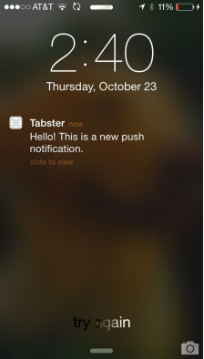

# Notifiche push

Abilita le notifiche push per le app iOS o Android che utilizzano Marketo Mobile SDK.

## Configurare le notifiche push in iOS

Esistono tre passaggi per abilitare le notifiche push:

1. Configura le notifiche push nel tuo account Apple Developer.
1. Abilita le notifiche push in xCode.
1. Abilita le notifiche push nell’app con Marketo SDK.

### Configurare le notifiche push sull’account Apple Developer

1. Accedi ad Apple Developer [Centro membri](https://developer.apple.com/membercenter).
1. Seleziona &quot;Certificati, identificatori e profili&quot;.
1. Seleziona la cartella &quot;Certificati->Tutti&quot; in &quot;iOS, tvOS, watchOS&quot;.
1. Seleziona il segno &quot;+&quot; accanto ai certificati nell’angolo in alto a sinistra. 
1. Seleziona &quot;Apple Push Notification service SSL (Sandbox &amp; Production)&quot;, quindi seleziona Continua.
1. Selezionare l&#39;identificatore dell&#39;applicazione utilizzato per generare l&#39;app.
1. Crea e carica un CSR per generare il certificato push. 
1. Scarica il certificato e fai doppio clic su di esso per installarlo. 
1. Aprire &quot;Accesso portachiavi&quot;, fare clic con il pulsante destro del mouse sul certificato ed esportare entrambi gli elementi nel file `.p12`.
1. Carica questo file tramite Marketo Admin Console per configurare le notifiche.
1. Aggiornare i profili di provisioning delle app.

### Abilitare le notifiche push in xCode

Attiva la funzionalità di notifica push nel progetto xCode.

### Abilitare le notifiche push in app con Marketo SDK

Aggiungere il codice seguente al file `AppDelegate.m` per inviare notifiche push ai dispositivi dei clienti.

**Nota** - Se si utilizza l&#39;estensione [!DNL Adobe Launch], utilizzare `ALMarketo` come nome della classe.

Aggiungi la seguente importazione a `AppDelegate.h`.

>[!BEGINTABS]

>[!TAB Obiettivo C]

```objectivec
#import <UserNotifications/UserNotifications.h>
```

>[!TAB Swift]

```swift
import UserNotifications
```

>[!ENDTABS]

Aggiungi `UNUserNotificationCenterDelegate` a `AppDelegate` come mostrato di seguito.

>[!BEGINTABS]

>[!TAB Obiettivo C]

```objectivec
@interface AppDelegate : UIResponder <UIApplicationDelegate, UNUserNotificationCenterDelegate>
```

>[!TAB Swift]

```swift
class AppDelegate: UIResponder, UIApplicationDelegate , UNUserNotificationCenterDelegate
```

>[!ENDTABS]

Aggiungi il seguente codice per inizializzare il servizio di notifica push.

>[!BEGINTABS]

>[!TAB Obiettivo C]

```objectivec
BOOL)application:(UIApplication *)application didFinishLaunchingWithOptions:(NSDictionary *)launchOptions {
UNUserNotificationCenter *center = [UNUserNotificationCenter currentNotificationCenter];
        center.delegate = self;
        [center requestAuthorizationWithOptions:(UNAuthorizationOptionSound | UNAuthorizationOptionAlert | UNAuthorizationOptionBadge) completionHandler:^(BOOL granted, NSError * _Nullable error){
            if(!error){
                dispatch_async(dispatch_get_main_queue(), ^{
                    [[UIApplication sharedApplication] registerForRemoteNotifications];
                });
            }
        }];

    return YES;
}
```

>[!TAB Swift]

```swift
func application(_ application: UIApplication, didFinishLaunchingWithOptions launchOptions: [UIApplication.LaunchOptionsKey: Any]?) -> Bool {

    UNUserNotificationCenter.current().requestAuthorization(options: [.alert, .sound,    .badge]) { granted, error in
            if let error = error {
                print("\(error.localizedDescription)")
            } else {
                DispatchQueue.main.async {
                    application.registerForRemoteNotifications()
                }
            }
        }

        return true
}
```

>[!ENDTABS]

Chiama questo metodo per avviare la registrazione al servizio push di Apple. Se la registrazione ha esito positivo, l&#39;app chiama il metodo `application:didRegisterForRemoteNotificationsWithDeviceToken:` dell&#39;oggetto delegato dell&#39;app e gli trasmette un token dispositivo.

Se la registrazione non riesce, l&#39;app chiama il metodo `application:didFailToRegisterForRemoteNotificationsWithError:` del delegato dell&#39;app.

Registra il token push con Marketo. Il token del dispositivo deve essere registrato per ricevere notifiche push da Marketo.

>[!BEGINTABS]

>[!TAB Obiettivo C]

```objectivec
- (void)application:(UIApplication *)application didRegisterForRemoteNotificationsWithDeviceToken:(NSData *)deviceToken {
    // Register the push token with Marketo
    [[Marketo sharedInstance] registerPushDeviceToken:deviceToken];
}
```

>[!TAB Swift]

```swift
func application(_ application: UIApplication, didRegisterForRemoteNotificationsWithDeviceToken deviceToken: Data) {
    // Register the push token with Marketo
    Marketo.sharedInstance().registerPushDeviceToken(deviceToken)
}
```

>[!ENDTABS]

Puoi anche annullare la registrazione del token quando l’utente si disconnette.

>[!BEGINTABS]

>[!TAB Obiettivo C]

```objectivec
[[Marketo sharedInstance] unregisterPushDeviceToken];
```

>[!TAB Swift]

```swift
Marketo.sharedInstance().unregisterPushDeviceToken
```

>[!ENDTABS]

Per registrare nuovamente il token push, estrai il codice dal passaggio 3 in un metodo AppDelegate. Chiamare tale metodo dal metodo di accesso ViewController.

Gestisci la notifica push dopo la registrazione del token dispositivo con Marketo.

>[!BEGINTABS]

>[!TAB Obiettivo C]

```objectivec
- (void)application:(UIApplication *)application didReceiveRemoteNotification:(NSDictionary *)userInfo
{
    [[Marketo sharedInstance] handlePushNotification:userInfo];
}
```

>[!TAB Swift]

```swift
func application(_ application: UIApplication, didReceiveRemoteNotification userInfo: [AnyHashable : Any]) {
    Marketo.sharedInstance().handlePushNotification(userInfo)
}
```

>[!ENDTABS]

Aggiungere il metodo seguente a AppDelegate.

Utilizza questo metodo per visualizzare un avviso, riprodurre un suono o aumentare il badge mentre l’app è in primo piano. Chiama il completionHandler appropriato in questo metodo.

>[!BEGINTABS]

>[!TAB Obiettivo C]

```objectivec
-(void)userNotificationCenter:(UNUserNotificationCenter *)center
    willPresentNotification:(UNNotification *)notification
        withCompletionHandler:(void (^)(UNNotificationPresentationOptions options))completionHandler{

    completionHandler(UNAuthorizationOptionSound | UNAuthorizationOptionAlert | UNAuthorizationOptionBadge);
}
```

>[!TAB Swift]

```swift
func userNotificationCenter(_ center: UNUserNotificationCenter,
            willPresent notification: UNNotification, withCompletionHandler completionHandler: @escaping (
    UNNotificationPresentationOptions) -> Void) {
    completionHandler([.alert, .sound,.badge])
}
```

>[!ENDTABS]

Gestisce le notifiche push appena ricevute in AppDelegate.

Il delegato chiama questo metodo quando l&#39;utente risponde a una notifica aprendo l&#39;applicazione, ignorando la notifica o scegliendo un UNNotificationAction. Impostare il delegato prima che l&#39;applicazione restituisca applicationDidFinishLaunching:.

>[!BEGINTABS]

>[!TAB Obiettivo C]

```objectivec
- (void)userNotificationCenter:(UNUserNotificationCenter *)center
didReceiveNotificationResponse:(UNNotificationResponse *)response withCompletionHandler:(void(^)(void))completionHandler {
    [[Marketo sharedInstance] userNotificationCenter:center didReceiveNotificationResponse:response withCompletionHandler:completionHandler];
}
```

>[!TAB Swift]

```swift
func userNotificationCenter(_ center: UNUserNotificationCenter,
                                didReceive response: UNNotificationResponse,
                                withCompletionHandler
                                completionHandler: @escaping () -> Void) {
        Marketo.sharedInstance().userNotificationCenter(center, didReceive: response, withCompletionHandler: completionHandler)
}
```

>[!ENDTABS]

Tracciare le notifiche push.

Se l’app è in background o inattiva, il dispositivo riceve una notifica push come mostrato di seguito. Marketo tiene traccia di quando l’utente seleziona la notifica.



Quando il dispositivo riceve una notifica push, la trasmette al callback `application:didReceiveRemoteNotification:` sul delegato dell&#39;app.

Il seguente registro attività di Marketo mostra gli eventi dell’app e gli eventi di notifica push.


## Configurare le notifiche push in Android

1. Aggiungi le seguenti autorizzazioni all’interno del tag dell’applicazione.

   Apri `AndroidManifest.xml` e aggiungi le seguenti autorizzazioni. L&#39;app deve richiedere le autorizzazioni &quot;INTERNET&quot; e &quot;ACCESS_NETWORK_STATE&quot;. Ignora questo passaggio se l’app li richiede già.

   ```xml
   <uses‐permission android:name="android.permission.INTERNET"/>
   <uses‐permission android:name="android.permission.ACCESS_NETWORK_STATE"/>
   
   <!‐‐Following permissions are required for push notification.‐‐>
   <uses-permission android:name="android.permission.GET_ACCOUNTS"/>
   <!‐‐Keeps the processor from sleeping when a message is received.‐‐>
   <uses-permission android:name="android.permission.WAKE_LOCK"/>
   <permission android:name="<PACKAGE_NAME>.permission.C2D_MESSAGE" android:protectionLevel="signature" />
   <uses-permission android:name="<PACKAGE_NAME>.permission.C2D_MESSAGE" />
   <!-- This app has permission to register and receive data message. -->
   <uses-permission android:name="com.google.android.c2dm.permission.RECEIVE" />
   ```

1. Configurare FCM con HTTPv1.

   - Abilitare MME FCM HTTPv1 in Gestione funzioni di Marketo. 
   - Carica il file JSON dell’account di servizio per l’app in MLM.
   - Scarica il file Json dell’account di servizio da Firebase Console. 
   - Attendi un’ora dopo il caricamento del file Json dell’account di servizio in Marketo prima di inviare le notifiche push.

## Dispositivi di prova Android

Aggiungi Attività Marketo al file manifesto all’interno del tag dell’applicazione.

```xml
<activity android:name="com.marketo.MarketoActivity"  android:configChanges="orientation|screenSize">
    <intent-filter android:label="MarketoActivity">
        <action  android:name="android.intent.action.VIEW"/>
        <category  android:name="android.intent.category.DEFAULT"/>
        <category  android:name="android.intent.category.BROWSABLE"/>
        <data android:host="add_test_device" android:scheme="mkto"/>
    </intent-filter/>
</activity/>
```

## Registra servizio push Marketo

1. Aggiungere il servizio di messaggistica Firebase a `AndroidManifest.xml` prima del tag applicazione di chiusura.

   ```xml
   <meta-data
       android:name="com.google.android.gms.version"
       android:value="@integer/google_play_services_version" />
   <service android:name=".MyFirebaseMessagingService">
   <intent-filter>
   <action android:name="com.google.firebase.INSTANCE_ID_EVENT"/>
   <action android:name="com.google.firebase.MESSAGING_EVENT"/>
   </intent-filter>
   </service>
   ```

1. Aggiungere i metodi SDK di Marketo a `MyFirebaseMessagingService` come indicato di seguito.

   ```java
   import com.marketo.Marketo;
   
   public class MyFirebaseMessagingService extends FirebaseMessagingService {
   
       @Override
       public void onNewToken(String s) {
           super.onNewToken(s);
           Marketo marketoSdk = Marketo.getInstance(this.getApplicationContext());
           marketoSdk.setPushNotificaitonToken(s);
           // Add your code here...
       }
   
       @Override
       public void onMessageReceived(RemoteMessage remoteMessage) {
           Marketo marketoSdk = Marketo.getInstance(this.getApplicationContext());
           marketoSdk.showPushNotificaiton(remoteMessage);
           // Add your code here...
       }
   
   }
   ```

   **Nota** - Se utilizzi l&#39;estensione Adobe, aggiungi il seguente codice.

   ```java
   import com.marketo.Marketo;
   
   public class MyFirebaseMessagingService extends FirebaseMessagingService {
   
       @Override
       public void onNewToken(String token) {
           super.onNewToken(token);
           ALMarketo.setPushNotificationToken(token);
           // Add your code here...
       }
   
       @Override
       public void onMessageReceived(RemoteMessage remoteMessage) {
           ALMarketo.showPushNotification(remoteMessage);
           // Add your code here...
       }
   
   }
   ```

**NOTA**: FCM SDK aggiunge automaticamente le autorizzazioni richieste e la funzionalità del ricevitore. Se utilizzavi una versione precedente di SDK, rimuovi i seguenti elementi obsoleti, che potrebbero causare la duplicazione dei messaggi.

```xml
<receiver android:name="com.marketo.MarketoBroadcastReceiver" android:permission="com.google.android.c2dm.permission.SEND">
    <intent-filter>
        <!‐‐Receives the actual messages.‐‐>
        <action android:name="com.google.android.c2dm.intent.RECEIVE"/>
        <!‐‐Register to enable push notification‐‐>
        <action android:name="com.google.android.c2dm.intent.REGISTRATION"/>
        <!‐‐‐Replace YOUR_PACKAGE_NAME with your own package name‐‐>
        <category android:name="YOUR_PACKAGE_NAME"/>
    </intent-filter>
</receiver>

<!‐‐Marketo service to handle push registration and notification‐‐>
<service android:name="com.marketo.MarketoIntentService"/>
```

1. Inizializza Marketo Push. Dopo aver salvato la configurazione, crea o apri la classe Application e aggiungi il seguente codice. Ottieni l’ID mittente da Firebase Console.

   ```java
   Marketo marketoSdk = Marketo.getInstance(getApplicationContext());
   
   // Enable push notification here. The push notification channel name can by any string
   marketoSdk.initializeMarketoPush(SENDER_ID,"ChannelName");
   ```

   Se si utilizza l&#39;estensione [!DNL Adobe Launch], utilizzare il codice seguente.

   ```java
   // Enable push notification here. The push notification channel name can by any string
   ALMarketo.initializeMarketoPush(SENDER_ID,"ChannelName");
   ```

   Se non disponi di un SENDER_ID, abilita Google Cloud Messaging Service completando i passaggi descritti in [questa esercitazione](https://developers.google.com/cloud-messaging/).

   Puoi anche annullare la registrazione del token quando l’utente si disconnette.

   ```java
   marketoSdk.uninitializeMarketoPush();
   ```

   Se si utilizza l&#39;estensione [!DNL Adobe Launch], utilizzare il codice seguente.

   ```java
   ALMarketo.uninitializeMarketoPush();
   ```

   Nota: per registrare nuovamente il token push, estrai il codice dal passaggio 3 in un metodo AppDelegate. Chiamare tale metodo dal metodo di accesso ViewController.

1. Facoltativo: impostare un&#39;icona di notifica. Chiama il metodo seguente per configurare un’icona di notifica personalizzata.

   ```java
   MarketoConfig.Notification config = new MarketoConfig.Notification();
   // Optional bitmap for honeycomb and above
   config.setNotificationLargeIcon(bitmap);
   
   // Required icon Resource ID
   config.setNotificationSmallIcon(R.drawable.notification_small_icon);
   
   // Set the configuration
   //Use the static methods on ALMarketo class when using Adobe Extension
   Marketo.getInstance(context).setNotificationConfig(config);
   
   // Get the configuration set
   Marketo.getInstance(context).getNotificationConfig();
   ```

## Risoluzione dei problemi

Se i messaggi push per dispositivi mobili non funzionano come previsto, controlla i problemi di configurazione comuni prima di esaminare i dettagli di implementazione.

### Il messaggio push non viene visualizzato

Verifica se i messaggi push sono disabilitati sul dispositivo. Gli utenti mobili possono controllare se ricevono messaggi per ogni app e gli sviluppatori o gli addetti al marketing possono disabilitare i messaggi durante lo sviluppo.

Verifica se l’app è aperta e attiva. Quando l’app è attiva, i messaggi push mobili non vengono visualizzati sullo schermo. Vengono invece visualizzate nell’area &quot;Notifiche locali&quot; dell’app.

### Visualizzare i registri attività in Marketo

Utilizza i registri attività di Marketo per verificare che sia stato inviato un messaggio.

Esamina i record di attività di una persona che avrebbe dovuto ricevere il messaggio. Se il messaggio è stato inviato, il registro attività contiene un record. Se non esiste alcun record, controlla il certificato iOS o la configurazione della chiave API Android in Marketo.

### Certificato o chiave non valida

Verifica che sia caricato il certificato corretto per Sandbox o Produzione. Se necessario, riesporta i certificati iOS o le chiavi Android e ricaricali in Marketo.

### Il file .p12 non dispone di un certificato o di una chiave (iOS)

Quando esporti il certificato, esporta sia la chiave che il certificato.

### Provisioning dei profili non aggiornato (iOS)

Dopo aver aggiunto un dispositivo, aggiorna i profili di provisioning e genera nuovi certificati. Puntare il progetto Xcode ai profili e ai certificati corretti e importare i certificati in Marketo.

### Impossibile caricare il certificato iOS (IOS)

Verifica che la password utilizzata per esportare il certificato non contenga spazi. Ad esempio, invece di:

`Hello World 123`

utilizza questo:

`HelloWorld123`

### Risoluzione dei problemi dei certificati iOS

Per le applicazioni sandbox, utilizza un certificato &quot;sviluppatore&quot; o &quot;universale&quot;. Per le applicazioni di produzione, carica un certificato di &quot;distribuzione&quot; o &quot;universale&quot; valido.

### Notifica di mancato recapito push/Token non valido

Un token di registrazione può diventare non valido nei seguenti scenari:

- Se l’app client si annulla dalla registrazione a GCM.
- Se la registrazione dell’app client viene annullata automaticamente, ciò può accadere se l’utente disinstalla l’applicazione. Ad esempio, in iOS, se il servizio di feedback APNS ha segnalato il token APNS come non valido.
- Se il token di registrazione scade. Ad esempio, Google potrebbe decidere di aggiornare i token di registrazione o il token APNS è scaduto per i dispositivi iOS.
- Se l’app client viene aggiornata ma la nuova versione non è configurata per la ricezione di messaggi.
