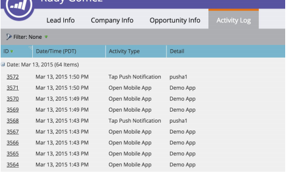

# Notifiche push

Abilitare le notifiche push.

## Configurare le notifiche push in iOS

Esistono tre passaggi per abilitare le notifiche push:

1. Configurare le notifiche push sull’account Apple Developer.
1. Abilita le notifiche push in xCode.
1. Abilita le notifiche push in app con Marketo SDK.

### Configurare le notifiche push sull’account Apple Developer

1. Accedi a Apple Developer [Centro membri](http://developer.apple.com/membercenter).
1. Fai clic su &quot;Certificati, identificatori e profili&quot;.
1. Fai clic sulla cartella &quot;Certificati->Tutti&quot; sotto &quot;iOS, tvOS, watchOS&quot;.
1. Selezionare &quot;+&quot; nella schermata in alto a sinistra accanto ai certificati 
1. Abilita la casella di controllo &quot;Apple Push Notification service SSL (Sandbox &amp; Production)&quot; e fai clic su &quot;Continua&quot;.
1. Selezionare l&#39;identificatore dell&#39;applicazione che si sta utilizzando per generare l&#39;app.
1. Crea e carica la CSR per generare il certificato push. 
1. Scaricare il certificato nel computer locale e fare doppio clic per installarlo. 
1. Aprire &quot;Accesso Portachiavi&quot;, fare clic con il pulsante destro del mouse sul certificato ed esportare 2 elementi nel file `.p12`.
1. Carica questo file tramite Marketo Admin Console per configurare le notifiche.
1. Aggiornare i profili di provisioning delle app.

### Abilitare le notifiche push in xCode

Attiva la funzionalità di notifica push nel progetto xCode.

### Abilitare le notifiche push in app con Marketo SDK

Aggiungi il seguente codice al file `AppDelegate.m` per inviare notifiche push ai dispositivi del cliente.

**Nota** - Se si utilizza l&#39;estensione [!DNL Adobe Launch], utilizzare `ALMarketo` come classname

Importa quanto segue in `AppDelegate.h`.

>[!BEGINTABS]

>[!TAB Obiettivo C]

```
#import <UserNotifications/UserNotifications.h>
```

>[!TAB Swift]

```
import UserNotifications
```

>[!ENDTABS]

Aggiungi `UNUserNotificationCenterDelegate` a `AppDelegate` come mostrato di seguito.

>[!BEGINTABS]

>[!TAB Obiettivo C]

```
@interface AppDelegate : UIResponder <UIApplicationDelegate, UNUserNotificationCenterDelegate>
```

>[!TAB Swift]

```
class AppDelegate: UIResponder, UIApplicationDelegate , UNUserNotificationCenterDelegate
```

>[!ENDTABS]

Avvia il servizio di notifica push. Per abilitare la notifica push, aggiungi il codice seguente.

>[!BEGINTABS]

>[!TAB Obiettivo C]

```objectivec
BOOL)application:(UIApplication *)application didFinishLaunchingWithOptions:(NSDictionary *)launchOptions {
UNUserNotificationCenter *center = [UNUserNotificationCenter currentNotificationCenter];
        center.delegate = self;
        [center requestAuthorizationWithOptions:(UNAuthorizationOptionSound | UNAuthorizationOptionAlert | UNAuthorizationOptionBadge) completionHandler:^(BOOL granted, NSError * _Nullable error){
            if(!error){
                dispatch_async(dispatch_get_main_queue(), ^{
                    [[UIApplication sharedApplication] registerForRemoteNotifications];
                });
            }
        }];

    return YES;
}
```

>[!TAB Swift]

```
func application(_ application: UIApplication, didFinishLaunchingWithOptions launchOptions: [UIApplication.LaunchOptionsKey: Any]?) -> Bool {

    UNUserNotificationCenter.current().requestAuthorization(options: [.alert, .sound,    .badge]) { granted, error in
            if let error = error {
                print("\(error.localizedDescription)")
            } else {
                DispatchQueue.main.async {
                    application.registerForRemoteNotifications()
                }
            }
        }

        return true
}
```

>[!ENDTABS]

Chiama questo metodo per avviare il processo di registrazione con il servizio push di Apple. Se la registrazione ha esito positivo, l&#39;app chiama il metodo `application:didRegisterForRemoteNotificationsWithDeviceToken:` dell&#39;oggetto delegato dell&#39;app e gli trasmette un token dispositivo.

Se la registrazione non riesce, l&#39;app chiama il metodo `application:didFailToRegisterForRemoteNotificationsWithError:` del delegato dell&#39;app.

Registrare il token di push con Marketo. Per ricevere le notifiche push da Marketo è necessario registrare il token del dispositivo con Marketo.

>[!BEGINTABS]

>[!TAB Obiettivo C]

```
- (void)application:(UIApplication *)application didRegisterForRemoteNotificationsWithDeviceToken:(NSData *)deviceToken {
    // Register the push token with Marketo
    [[Marketo sharedInstance] registerPushDeviceToken:deviceToken];
}
```

>[!TAB Swift]

```
func application(_ application: UIApplication, didRegisterForRemoteNotificationsWithDeviceToken deviceToken: Data) {
    // Register the push token with Marketo
    Marketo.sharedInstance().registerPushDeviceToken(deviceToken)
}
```

>[!ENDTABS]

È inoltre possibile annullare la registrazione del token quando l’utente si disconnette.

>[!BEGINTABS]

>[!TAB Obiettivo C]

```
[[Marketo sharedInstance] unregisterPushDeviceToken];
```

>[!TAB Swift]

```
Marketo.sharedInstance().unregisterPushDeviceToken
```

>[!ENDTABS]

Per registrare nuovamente il token push, estrai il codice dal passaggio 3 in un metodo AppDelegate e chiama dal metodo di accesso ViewController.

Gestisce le notifiche push. Per ricevere le notifiche push da Marketo è necessario registrare il token del dispositivo con Marketo.

>[!BEGINTABS]

>[!TAB Obiettivo C]

```
- (void)application:(UIApplication *)application didReceiveRemoteNotification:(NSDictionary *)userInfo
{
    [[Marketo sharedInstance] handlePushNotification:userInfo];
}
```

>[!TAB Swift]

```
func application(_ application: UIApplication, didReceiveRemoteNotification userInfo: [AnyHashable : Any]) {
    Marketo.sharedInstance().handlePushNotification(userInfo)
}
```

>[!ENDTABS]

Aggiungi il seguente metodo in AppDelegate

Utilizzando questo metodo puoi presentare un avviso, un suono o un contrassegno in aumento mentre l’app è in primo piano. In questo metodo è necessario chiamare completionHandler desiderato.

>[!BEGINTABS]

>[!TAB Obiettivo C]

```
-(void)userNotificationCenter:(UNUserNotificationCenter *)center
    willPresentNotification:(UNNotification *)notification
        withCompletionHandler:(void (^)(UNNotificationPresentationOptions options))completionHandler{

    completionHandler(UNAuthorizationOptionSound | UNAuthorizationOptionAlert | UNAuthorizationOptionBadge);
}
```

>[!TAB Swift]

```
func userNotificationCenter(_ center: UNUserNotificationCenter,
            willPresent notification: UNNotification, withCompletionHandler completionHandler: @escaping (
    UNNotificationPresentationOptions) -> Void) {
    completionHandler([.alert, .sound,.badge])
}
```

>[!ENDTABS]

Gestire le notifiche push appena ricevute in AppDelegate

Il metodo verrà richiamato sul delegato quando l&#39;utente ha risposto alla notifica aprendo l&#39;applicazione, ignorando la notifica o scegliendo un UNNotificationAction. È necessario impostare il delegato prima che l&#39;applicazione venga restituita da applicationDidFinishLaunching:.

>[!BEGINTABS]

>[!TAB Obiettivo C]

```
- (void)userNotificationCenter:(UNUserNotificationCenter *)center
didReceiveNotificationResponse:(UNNotificationResponse *)response withCompletionHandler:(void(^)(void))completionHandler {
    [[Marketo sharedInstance] userNotificationCenter:center didReceiveNotificationResponse:response withCompletionHandler:completionHandler];
}
```

>[!TAB Swift]

```
func userNotificationCenter(_ center: UNUserNotificationCenter,
                                didReceive response: UNNotificationResponse,
                                withCompletionHandler
                                completionHandler: @escaping () -> Void) {
        Marketo.sharedInstance().userNotificationCenter(center, didReceive: response, withCompletionHandler: completionHandler)
}
```

>[!ENDTABS]

Tracciare le notifiche push

Se l&#39;app è in esecuzione in background (o non è attiva), il dispositivo riceverà una notifica push come mostrato di seguito. Marketo tiene traccia di quando l’utente tocca la notifica.


Se il dispositivo riceve una notifica push, verrà passata al callback `application:didReceiveRemoteNotification:` sul delegato dell&#39;app.

Di seguito è riportato un registro attività di Marketo da Marketo che mostra gli eventi dell’app e gli eventi di notifica push.



## Configurare le notifiche push in Android

1. Aggiungi la seguente autorizzazione all’interno del tag dell’applicazione.

   Apri `AndroidManifest.xml` e aggiungi le seguenti autorizzazioni. L&#39;app deve richiedere le autorizzazioni &quot;INTERNET&quot; e &quot;ACCESS_NETWORK_STATE&quot;. Se l&#39;app richiede già queste autorizzazioni, salta questo passaggio.

   ```xml
   <uses‐permission android:name="android.permission.INTERNET"/>
   <uses‐permission android:name="android.permission.ACCESS_NETWORK_STATE"/>
   
   <!‐‐Following permissions are required for push notification.‐‐>
   <uses-permission android:name="android.permission.GET_ACCOUNTS"/>
   <!‐‐Keeps the processor from sleeping when a message is received.‐‐>
   <uses-permission android:name="android.permission.WAKE_LOCK"/>
   <permission android:name="<PACKAGE_NAME>.permission.C2D_MESSAGE" android:protectionLevel="signature" />
   <uses-permission android:name="<PACKAGE_NAME>.permission.C2D_MESSAGE" />
   <!-- This app has permission to register and receive data message. -->
   <uses-permission android:name="com.google.android.c2dm.permission.RECEIVE" />
   ```

1. Configurazione di FCM con HTTPv1 (Google ha [il protocollo XMPP ](https://firebase.google.com/docs/cloud-messaging/xmpp-server-ref) dichiarato obsoleto il 12 giugno 2023 e verrà rimosso a giugno 2024)

- Abilitare MME FCM HTTPv1 nel gestore delle funzionalità di Marketo 
   - Carica il file JSON dell’account del servizio per l’app in MLM.
   - Puoi scaricare il file Json dell’account di servizio da Firebase Console.   
   - Attendi un’ora dopo il caricamento del file Json dell’account di servizio in Marketo prima di inviare le notifiche push.  

## Dispositivi di prova Android

Aggiungi l’attività Marketo nel file manifesto all’interno del tag dell’applicazione.

```xml
<activity android:name="com.marketo.MarketoActivity"  android:configChanges="orientation|screenSize">
    <intent-filter android:label="MarketoActivity">
        <action  android:name="android.intent.action.VIEW"/>
        <category  android:name="android.intent.category.DEFAULT"/>
        <category  android:name="android.intent.category.BROWSABLE"/>
        <data android:host="add_test_device" android:scheme="mkto"/>
    </intent-filter/>
</activity/>
```

## Registra servizio push Marketo

1. Per ricevere notifiche push da Marketo, devi aggiungere il servizio di messaggistica Firebase al tuo `AndroidManifest.xml`. Aggiungi prima del tag applicazione di chiusura.

   ```xml
   <meta-data
       android:name="com.google.android.gms.version"
       android:value="@integer/google_play_services_version" />
   <service android:name=".MyFirebaseMessagingService">
   <intent-filter>
   <action android:name="com.google.firebase.INSTANCE_ID_EVENT"/>
   <action android:name="com.google.firebase.MESSAGING_EVENT"/>
   </intent-filter>
   </service>
   ```

1. Aggiungere i metodi di Marketo SDK nel file `MyFirebaseMessagingService` come segue

   ```java
   import com.marketo.Marketo;
   
   public class MyFirebaseMessagingService extends FirebaseMessagingService {
   
       @Override
       public void onNewToken(String s) {
           super.onNewToken(s);
           Marketo marketoSdk = Marketo.getInstance(this.getApplicationContext());
           marketoSdk.setPushNotificaitonToken(s);
           // Add your code here...
       }
   
       @Override
       public void onMessageReceived(RemoteMessage remoteMessage) {
           Marketo marketoSdk = Marketo.getInstance(this.getApplicationContext());
           marketoSdk.showPushNotificaiton(remoteMessage);
           // Add your code here...
       }
   
   }
   ```

   **Nota** - Se utilizzi l&#39;estensione Adobe, aggiungi come segue

   ```java
   import com.marketo.Marketo;
   
   public class MyFirebaseMessagingService extends FirebaseMessagingService {
   
       @Override
       public void onNewToken(String token) {
           super.onNewToken(token);
           ALMarketo.setPushNotificationToken(token);
           // Add your code here...
       }
   
       @Override
       public void onMessageReceived(RemoteMessage remoteMessage) {
           ALMarketo.showPushNotification(remoteMessage);
           // Add your code here...
       }
   
   }
   ```

**NOTA**: FCM SDK aggiunge automaticamente tutte le autorizzazioni necessarie e le funzionalità del ricevitore richieste. Assicurati di rimuovere i seguenti elementi obsoleti (e potenzialmente dannosi, in quanto potrebbero causare la duplicazione dei messaggi) dal manifesto della tua app se hai utilizzato versioni precedenti di SDK

```xml
<receiver android:name="com.marketo.MarketoBroadcastReceiver" android:permission="com.google.android.c2dm.permission.SEND">
    <intent-filter>
        <!‐‐Receives the actual messages.‐‐>
        <action android:name="com.google.android.c2dm.intent.RECEIVE"/>
        <!‐‐Register to enable push notification‐‐>
        <action android:name="com.google.android.c2dm.intent.REGISTRATION"/>
        <!‐‐‐Replace YOUR_PACKAGE_NAME with your own package name‐‐>
        <category android:name="YOUR_PACKAGE_NAME"/>
    </intent-filter>
</receiver>

<!‐‐Marketo service to handle push registration and notification‐‐>
<service android:name="com.marketo.MarketoIntentService"/>
```

1. Inizializza Marketo Push Dopo aver salvato la configurazione precedente, è necessario inizializzare Marketo Push Notification. Crea o apri la classe Application e copia/incolla il codice seguente. Puoi ottenere l’ID mittente dalla console Firebase.

   ```java
   Marketo marketoSdk = Marketo.getInstance(getApplicationContext());
   
   // Enable push notification here. The push notification channel name can by any string
   marketoSdk.initializeMarketoPush(SENDER_ID,"ChannelName");
   ```

   Se utilizzi l&#39;estensione [!DNL Adobe Launch], segui queste istruzioni

   ```java
   // Enable push notification here. The push notification channel name can by any string
   ALMarketo.initializeMarketoPush(SENDER_ID,"ChannelName");
   ```

   Se non disponi di un SENDER_ID, abilita Google Cloud Messaging Service completando i passaggi descritti in [questa esercitazione](https://developers.google.com/cloud-messaging/).

   È inoltre possibile annullare la registrazione del token quando l’utente si disconnette.

   ```java
   marketoSdk.uninitializeMarketoPush();
   ```

   Se utilizzi l&#39;estensione [!DNL Adobe Launch], utilizza l&#39;istruzione seguente

   ```java
   ALMarketo.uninitializeMarketoPush();
   ```

   Nota: per registrare nuovamente il token push, estrai il codice dal passaggio 3 in un metodo AppDelegate e chiama dal metodo di accesso ViewController.

1. Imposta icona notifica (facoltativo) per configurare un’icona di notifica personalizzata, è necessario chiamare il metodo seguente.

   ```java
   MarketoConfig.Notification config = new MarketoConfig.Notification();
   // Optional bitmap for honeycomb and above
   config.setNotificationLargeIcon(bitmap);
   
   // Required icon Resource ID
   config.setNotificationSmallIcon(R.drawable.notification_small_icon);
   
   // Set the configuration
   //Use the static methods on ALMarketo class when using Adobe Extension
   Marketo.getInstance(context).setNotificationConfig(config);
   
   // Get the configuration set
   Marketo.getInstance(context).getNotificationConfig();
   ```

## Risoluzione dei problemi

La configurazione dei messaggi push per dispositivi mobili prevede molti passaggi e il coordinamento di sviluppatori e addetti al marketing. Se stai incontrando delle difficoltà, ci sono alcune cose semplici che puoi controllare.

Dopo aver verificato che le cose semplici siano corrette, puoi approfondire i dettagli di programmazione.

### Il messaggio push non viene visualizzato

Innanzitutto, verifica se i messaggi push sono disabilitati sul ricevitore. Gli utenti di dispositivi mobili possono controllare se ricevere o meno messaggi per una particolare app. Spesso gli sviluppatori (e gli esperti di marketing) disabilitano questi messaggi ad un certo punto durante lo sviluppo. Pertanto, la prima cosa da verificare è se il destinatario ha disabilitato i messaggi push per l’app.

In secondo luogo, l’app è già aperta e attiva sul dispositivo? Quando l’app è attiva sul dispositivo, i messaggi push mobili non compaiono sullo schermo. Vengono invece visualizzate nell’area &quot;Notifiche locali&quot; dell’app.

### Visualizzare i registri attività in Marketo

La prima posizione da controllare quando si tiene traccia di un errore è nei registri attività di Marketo. Puoi utilizzare i registri attività per verificare che un messaggio sia stato inviato.

Nel registro attività esaminare i record attività relativi a una persona che avrebbe dovuto ricevere un messaggio. Se il messaggio è stato inviato, sarà presente un record nel registro attività. In caso contrario, il problema è probabilmente dovuto alla configurazione del certificato iOS o della chiave API Android in Marketo.

### Certificato o chiave non valida

Controlla nuovamente la configurazione per assicurarti di aver caricato il certificato corretto per Sandbox o Produzione. A volte è meglio chiedere allo sviluppatore di riesportare i certificati (iOS) o le chiavi (Android) e quindi ricaricarli in Marketo per assicurarsi che siano corretti.

### Il file .p12 non dispone di un certificato o di una chiave (iOS)

Quando si esporta il certificato, assicurarsi di esportare la chiave _e_ il certificato.

### Provisioning dei profili non aggiornato (iOS)

Ogni volta che aggiungi un nuovo dispositivo, devi aggiornare i profili di provisioning e generare nuovi certificati. Assicurati che il progetto Xcode punti quindi ai profili e ai certificati corretti e importa tali certificati in Marketo.

### Impossibile caricare il certificato iOS (IOS)

Assicurati che la password utilizzata durante l’esportazione del certificato non contenga spazi.  Ad esempio, invece di:

`Hello World 123`

utilizza questo:

`HelloWorld123`

### Risoluzione dei problemi dei certificati iOS

Per le applicazioni sandbox, puoi utilizzare un certificato &quot;sviluppatore&quot; o &quot;universale&quot;. Tuttavia, per le applicazioni di produzione è necessario caricare un certificato di &quot;distribuzione&quot; o &quot;universale&quot; valido.

### Notifica di mancato recapito push/Token non valido

Un token di registrazione esistente potrebbe non essere più valido in diversi casi, tra cui:

- Se l’app client si annulla dalla registrazione a GCM.
- Se la registrazione dell’app client viene annullata automaticamente, ciò può accadere se l’utente disinstalla l’applicazione. Ad esempio, in iOS, se il servizio di feedback APNS ha segnalato il token APNS come non valido.
- Se il token di registrazione scade. Ad esempio, Google potrebbe decidere di aggiornare i token di registrazione o il token APNS è scaduto per i dispositivi iOS.
- Se l’app client viene aggiornata ma la nuova versione non è configurata per la ricezione di messaggi.
