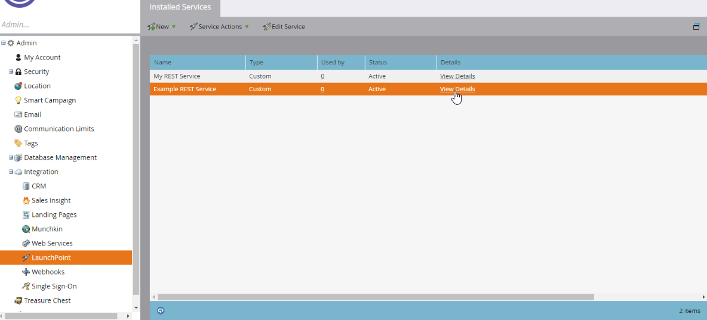

# Autenticazione

Le API REST di Marketo sono autenticate con OAuth 2.0 a 2 gambe. Gli ID client e i segreti client vengono forniti dai servizi personalizzati definiti dall’utente. Ogni servizio personalizzato è di proprietà di un utente solo API con un set di ruoli e autorizzazioni che autorizzano il servizio a eseguire azioni specifiche. Un token di accesso è associato a un singolo servizio personalizzato. La scadenza del token di accesso è indipendente dai token associati ad altri servizi personalizzati che possono essere presenti in un’istanza.

## Creazione di un token di accesso

`Client ID` e `Client Secret` si trovano nel menu **[!UICONTROL Admin]** > **[!UICONTROL Integration]** > **[!UICONTROL LaunchPoint]** selezionando il servizio personalizzato e facendo clic su **[!UICONTROL View Details]**.




`Identity URL` si trova nel menu **[!UICONTROL Admin]** > **[!UICONTROL Integration]** > **[!UICONTROL Web Services]** nella sezione REST API.

Crea un token di accesso utilizzando una richiesta HTTP GET (o POST) come segue:

```
GET <Identity URL>/oauth/token?grant_type=client_credentials&client_id=<Client Id>&client_secret=<Client Secret>
```

Se la richiesta era valida, riceverai una risposta JSON simile alla seguente:

```json
{
    "access_token": "cdf01657-110d-4155-99a7-f986b2ff13a0:int",
    "token_type": "bearer",
    "expires_in": 3599,
    "scope": "apis@acmeinc.com"
}
```

Definizione risposta

- `access_token` - Token passato con le chiamate successive per l&#39;autenticazione con l&#39;istanza di destinazione.
- `token_type` - Metodo di autenticazione OAuth.
- `expires_in` - Durata rimanente del token corrente in secondi (dopo la quale non è valido). Quando viene creato originariamente un token di accesso, la sua durata è di 3600 secondi o un’ora.
- `scope` - L&#39;utente proprietario del servizio personalizzato utilizzato per l&#39;autenticazione.

## Utilizzo di un token di accesso

Quando si effettuano chiamate ai metodi API REST, per garantire la riuscita della chiamata è necessario includere un token di accesso in ogni chiamata.
Il token di accesso deve essere inviato come intestazione HTTP.

>[!IMPORTANT]
>
>Il supporto per l&#39;autenticazione tramite il parametro di query `access_token` verrà rimosso il 31 ottobre 2025. Se il progetto utilizza un parametro di query per passare il token di accesso, è necessario aggiornarlo per utilizzare al più presto l&#39;[intestazione autorizzazione](https://experienceleague.adobe.com/en/docs/marketo-developer/marketo/rest/authentication#using-an-access-token). Il nuovo sviluppo deve utilizzare esclusivamente l&#39;intestazione `Authorization`.

### Passaggio all’intestazione Autorizzazione


Per passare dall&#39;utilizzo del parametro di query `access_token` a un&#39;intestazione Autorizzazione, è necessario apportare una piccola modifica al codice.

Utilizzando CURL come esempio, questo codice invia il valore `access_token` come parametro di modulo (il flag -F):

```bash
curl ...  -F access_token=<Access Token> <REST API Endpoint Base URL>/bulk/v1/apiCall.json
```

Questo codice invia lo stesso valore dell&#39;intestazione http `Authorization: Bearer` (il flag -H):

```bash
curl ... -H 'Authorization: Bearer <Access Token>' <REST API Endpoint Base URL>/bulk/v1/apiCall.json
```

## Suggerimenti e best practice

La gestione della scadenza dei token di accesso è importante per garantire il corretto funzionamento dell’integrazione e impedire il verificarsi di errori di autenticazione imprevisti durante il normale funzionamento. Durante la progettazione dell’autenticazione per l’integrazione, assicurati di memorizzare il token e il periodo di scadenza contenuti nella risposta Identity.

Prima di effettuare qualsiasi chiamata REST, è necessario verificare la validità del token in base alla durata rimanente. Se il token è scaduto, rinnovarlo chiamando l&#39;endpoint [Identity](https://developer.adobe.com/marketo-apis/api/identity/#tag/Identity/operation/identityUsingGET). In questo modo, la chiamata REST non avrà mai esito negativo a causa di un token scaduto. Questo consente di gestire la latenza delle chiamate REST in modo prevedibile, fondamentale per le applicazioni rivolte all’utente finale.

Se per autenticare una chiamata REST viene utilizzato un token scaduto, la chiamata REST non riuscirà e restituirà un codice di errore 602. Se viene utilizzato un token non valido per autenticare una chiamata REST, viene restituito un codice di errore 601. Se viene ricevuto uno di questi codici, il client deve rinnovare il token chiamando l’endpoint di identità.

Se chiami l’endpoint Identity prima della scadenza del token, nella risposta verranno restituiti lo stesso token e la durata rimanente.

Ricorda che i token di accesso sono di proprietà in base al servizio personalizzato e non in base all’utente. Anche se due risposte di identità possono avere l’ambito dello stesso utente, i token di accesso e i periodi di scadenza sono indipendenti l’uno dall’altro se sono stati creati con credenziali di due servizi diversi. Tieni presente questo aspetto se disponi di più set di credenziali nella stessa applicazione; l’ID client può essere una chiave utile per gestirli in modo indipendente.
