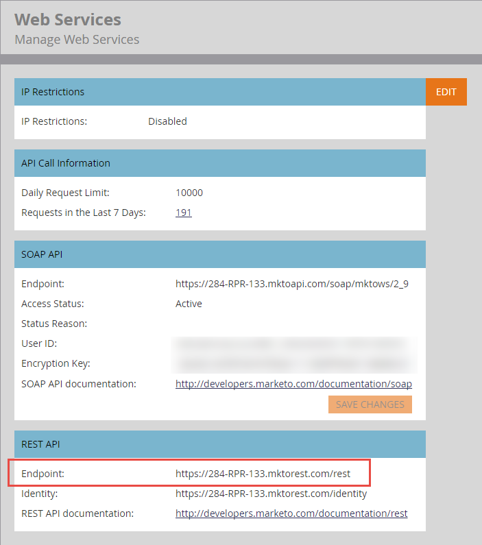

# URL di base

Ogni chiamata API in [Riferimento endpoint](endpoint-reference.md) specifica il metodo, il percorso, la risorsa e i parametri REST. Aggiungi questi componenti all’URL di base per creare una richiesta.

Di seguito è riportato un esempio di URL REST ben formato:

`https://284-RPR-133.mktorest.com/rest/v1/lead/318581.json?fields=email,firstName,lastName`

L’esempio contiene i seguenti componenti:

- **URL di base:** `https://284-RPR-133.mktorest.com/rest`
- **Percorso:** `/v1/lead/`
- **Risorsa:** `318582.json`
- **Parametro query:** `fields=email,firstName,lastName`

L’URL di base contiene l’ID account, noto anche come Munchkin ID, ed è univoco per ogni abbonamento a Marketo.

Per trovare l&#39;URL di base, accedere a Marketo e passare a **[!UICONTROL Admin]** > **[!UICONTROL Integration]** > **[!UICONTROL Web Services]**. L’URL di base è etichettato come &quot;Endpoint:&quot; nella sezione &quot;REST API&quot;, come mostrato nell’immagine seguente.

Copia l’URL di base e includilo nell’URL per ogni chiamata API REST.
