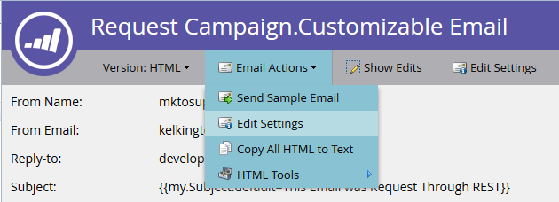
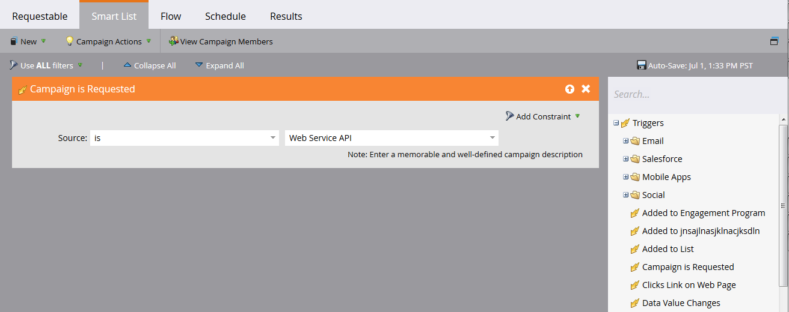

# E-mail transazionale

Utilizza l&#39;API [Richiedi campagna](https://developer.adobe.com/marketo-apis/api/mapi#tag/Campaigns/operation/triggerCampaignUsingPOST) per inviare e-mail transazionali a record Marketo specifici. Configura l’e-mail e attiva la campagna prima di effettuare la richiesta.

- Assicurati che il destinatario disponga di un record Marketo.
- Crea e approva un’e-mail transazionale nell’istanza di Marketo.
- Attiva una campagna di trigger che utilizza &quot;Campaign is Requested, 1. Source: Web Service API&quot; e invia l’e-mail.

Innanzitutto, [crea e approva l&#39;e-mail](https://experienceleague.adobe.com/docs/marketo/using/home.html?lang=it). Se l’e-mail è giuridicamente operativa, configurala in Azioni e-mail > Impostazioni e-mail:




Approva l’e-mail prima di creare la campagna:


Se necessario, vedere [Creare una nuova campagna avanzata](https://experienceleague.adobe.com/docs/marketo/using/product-docs/core-marketo-concepts/smart-campaigns/creating-a-smart-campaign/create-a-new-smart-campaign.html). Configura l’elenco avanzato della campagna con il trigger Campaign is Requested:



Configura un passaggio del flusso Invia e-mail che fa riferimento all’e-mail transazionale:


Prima dell’attivazione, configura le impostazioni di qualifica nella scheda Pianificazione. Mantieni l’impostazione predefinita se ogni record deve ricevere l’e-mail una sola volta. In caso contrario, consenti ai destinatari di qualificarsi ogni volta o a una cadenza disponibile.

Attiva la campagna:


## Invio delle chiamate API

Gli esempi Java utilizzano il pacchetto [minimal-json](https://github.com/ralfstx/minimal-json) per gestire le rappresentazioni JSON.

Prima di inviare l’e-mail, verifica che esista un record Marketo per l’indirizzo e-mail e recuperane l’ID lead. Questo esempio presuppone che l’indirizzo e-mail esista già.

Utilizza [Ottieni lead per tipo di filtro](https://developer.adobe.com/marketo-apis/api/mapi#tag/Leads/operation/getLeadsByFilterUsingGET) per recuperare l&#39;ID. Il metodo principale seguente richiede quindi la campagna:

```java
package dev.marketo.blog_request_campaign;

import com.eclipsesource.json.JsonArray;

public class App
{
    public static void main( String[] args )
    {
        //Create an instance of Auth so that we can authenticate with our Marketo instance
        Leads leadsRequest = new Leads(auth).setFilterType("email").addFilterValue("requestCampaign.test@marketo.com");

        //Create and parameterize an instance of Leads
        //Set your email filterValue appropriately
        Leads leadsRequest = new Leads(auth).setFilterType("email").addFilterValue("test.requestCamapign@example.com");

        //Get the inner results array of the response
        JsonArray leadsResult = leadsRequest.getData().get("result").asArray();

        //Get the id of the record indexed at 0
        int lead = leadsResult.get(0).asObject().get("id").asInt();

        //Set the ID of your campaign from Marketo
        int campaignId = 0;
        RequestCampaign rc = new RequestCampaign(auth, campaignId).addLead(lead);

        //Send the request to Marketo
        rc.postData();
    }
}
```

Estrarre la matrice dei risultati dalla risposta `JsonObject` e recuperare l&#39;oggetto in corrispondenza dell&#39;indice 0:

```java
JsonArray leadsResult = leadsRequest.getData().get("result").asArray();
int leadId = leadsResult.get(0).asObject().get("id").asInt();
```

Chiama Campagna richieste con l’ID campagna nell’URL della richiesta. Il corpo della richiesta contiene una matrice di oggetti JSON con un membro `id`:

```java
package dev.marketo.blog_request_campaign;
import java.io.IOException;
import java.io.InputStream;
import java.io.InputStreamReader;
import java.io.OutputStreamWriter;
import java.io.Reader;
import java.net.MalformedURLException;
import java.net.URL;
import java.util.ArrayList;
import javax.net.ssl.HttpsURLConnection;
import com.eclipsesource.json.JsonArray;
import com.eclipsesource.json.JsonObject;

public class RequestCampaign {
    private String endpoint;
    private Auth auth;
    public ArrayList leads = new ArrayList();
    public ArrayList tokens = new ArrayList();

    public RequestCampaign(Auth auth, int campaignId) {
        this.auth = auth;
        this.endpoint = this.auth.marketoInstance + "/rest/v1/campaigns/" + campaignId + "/trigger.json";
    }
    public RequestCampaign setLeads(ArrayList leads) {
        this.leads = leads;
        return this;
    }
    public RequestCampaign addLead(int lead){
        leads.add(lead);
        return this;
    }
    public RequestCampaign setTokens(ArrayList tokens) {
        this.tokens = tokens;
        return this;
    }
    public RequestCampaign addToken(String tokenKey, String val){
        JsonObject jo = new JsonObject().add("name", tokenKey);
        jo.add("value", val);
        tokens.add(jo);
        return this;
    }
    public JsonObject postData(){
        JsonObject result = null;
        try {
            JsonObject requestBody = buildRequest(); //builds the Json Request Body
            System.out.println("Executing RequestCampaign call\n" + "Endpoint: " + endpoint + "\nRequest Body:\n"  + requestBody);
            URL url = new URL(endpoint);
            HttpsURLConnection urlConn = (HttpsURLConnection) url.openConnection(); //Return a URL connection and cast to HttpsURLConnection
            urlConn.setRequestMethod("POST");
            urlConn.setRequestProperty("Content-type", "application/json");
            urlConn.setRequestProperty("accept", "text/json");
            urlConn.setDoOutput(true);
            OutputStreamWriter wr = new OutputStreamWriter(urlConn.getOutputStream());
            wr.write(requestBody.toString());
            wr.flush();
            InputStream inStream = urlConn.getInputStream(); //get the inputStream from the URL connection
            Reader reader = new InputStreamReader(inStream);
            result = JsonObject.readFrom(reader); //Read from the stream into a JsonObject
            System.out.println("Result:\n" + result);
        } catch (MalformedURLException e) {
            e.printStackTrace();
        } catch (IOException e) {
            e.printStackTrace();
        }
        return result;
    }

    private JsonObject buildRequest(){
        JsonObject requestBody = new JsonObject(); //Create a new JsonObject for the Request Body
        JsonObject input = new JsonObject();
        JsonArray leadsArray = new JsonArray();
        for (int lead : leads) {
            JsonObject jo = new JsonObject().add("id", lead);
            leadsArray.add(jo);
        }
        input.add("leads", leadsArray);
        JsonArray tokensArray = new JsonArray();
        for (JsonObject jo : tokens) {
            tokensArray.add(jo);
        }
        input.add("tokens", tokensArray);
        requestBody.add("input", input);
        return requestBody;
    }

}
```

Questa classe ha un costruttore che esegue un’autenticazione e l’ID della campagna. I lead vengono aggiunti all&#39;oggetto passando un `ArrayList<Integer>` contenente gli ID dei record a setLeads oppure utilizzando addLead, che prende un numero intero e lo aggiunge all&#39;oggetto ArrayList esistente nella proprietà lead. Per attivare la chiamata API per passare i record dei lead alla campagna, è necessario chiamare postData, che restituisce un JsonObject contenente i dati di risposta della richiesta. Quando viene chiamata la campagna di richiesta, ogni lead passato alla chiamata verrà elaborato dalla campagna del trigger di destinazione in Marketo e gli verrà inviata l’e-mail creata in precedenza. Congratulazioni, hai attivato un’e-mail tramite l’API REST di Marketo. Tieni d’occhio la Parte 2, in cui esaminiamo la personalizzazione dinamica del contenuto di un’e-mail tramite Request Campaign.

### Creazione dell’e-mail

Per personalizzare il contenuto, è innanzitutto necessario configurare un [programma](https://experienceleague.adobe.com/docs/marketo/using/product-docs/core-marketo-concepts/programs/creating-programs/create-a-program.html) e un [messaggio e-mail](https://experienceleague.adobe.com/docs/marketo/using/home.html?lang=it) in Marketo. Per generare il contenuto personalizzato, è necessario creare token all’interno del programma, quindi inserirli nell’e-mail che stiamo per inviare. Per semplicità, in questo esempio viene utilizzato un solo token, ma è possibile sostituire qualsiasi numero di token in un’e-mail, in Da e-mail, Da nome, Risposta o qualsiasi parte di contenuto nell’e-mail. Quindi creiamo un token Rich Text per la sostituzione e chiamiamolo &quot;bodyReplacement&quot;. Il formato Rich Text consente di sostituire qualsiasi contenuto nel token con HTML arbitrari che si desidera inserire.


Non è possibile salvare i token mentre sono vuoti, quindi inserisci qui del testo segnaposto. Ora dobbiamo inserire il token nell’e-mail:


Questo token sarà ora accessibile per la sostituzione tramite una chiamata Request Campaign. Questo token può essere semplice come una singola riga di testo che deve essere sostituita per e-mail o può includere quasi l’intero layout dell’e-mail.

### Il codice

```java
package dev.marketo.blog_request_campaign;

import com.eclipsesource.json.JsonArray;

public class App
{
    public static void main( String[] args )
    {
        //Create an instance of Auth so that we can authenticate with our Marketo instance
        Auth auth = new Auth("Client ID - CHANGE ME", "Client Secret - CHANGE ME", "Host - CHANGE ME");

        //Create and parameterize an instance of Leads
        Leads leadsRequest = new Leads(auth).setFilterType("email").addFilterValue("requestCampaign.test@marketo.com");

        //get the inner results array of the response
        JsonArray leadsResult = leadsRequest.getData().get("result").asArray();

        //get the id of the record indexed at 0
        int lead = leadsResult.get(0).asObject().get("id").asInt();

        //Set the ID of our campaign from Marketo
        int campaignId = 1578;
        RequestCampaign rc = new RequestCampaign(auth, campaignId).addLead(lead);

        //Create the content of the token here, and add it to the request
        String bodyReplacement = "<div class=\"replacedContent\"><p>This content has been replaced</p></div>";
        rc.addToken("{{my.bodyReplacement}}", bodyReplacement);
        rc.postData();
    }
}
```

Se il codice ha un aspetto familiare, è perché ha solo due righe aggiuntive dal metodo principale precedente. Questa volta stiamo creando il contenuto del token nella variabile bodyReplacement e quindi utilizzando il metodo addToken per aggiungerlo alla richiesta. addToken prende una chiave e un valore, quindi crea una rappresentazione JsonObject e la aggiunge all’array dei token interni. Viene quindi serializzato durante il metodo postData e viene creato un corpo simile al seguente:

```json
{
    "input":
    {
        "leads": [
            {
                "id": 1
            }
        ],
        "tokens": [
            {
                "name": "{{my.bodyReplacement}}",
                "value": "<div class=\"replacedContent\"><p>This content has been replaced</p></div>"
            }
        ]
    }
}
```

Combinato, l’output della console si presenta così:

```bash
Token is empty or expired. Trying new authentication
Trying to authenticate with ...
Got Authentication Response: {"access_token":"19d51b9a-ff60-4222-bbd5-be8b206f1d40:st","token_type":"bearer","expires_in":3565,"scope":"apiuser@mktosupport.com"}
Executing RequestCampaign call
Endpoint: .../rest/v1/campaigns/1578/trigger.json
Request Body:
{"input":{"leads":[{"id":1}],"tokens":[{"name":"{{my.bodyReplacement}}","value":"<div class=\"replacedContent\"><p>This content has been replaced</p></div>"}]}}
Result:
{"requestId":"1e8d#14eadc5143d","result":[{"id":1578}],"success":true}
```

## Ritorno a capo

Questo metodo è estensibile in diversi modi, modificando il contenuto nelle e-mail all’interno di singole sezioni di layout o all’esterno delle e-mail, consentendo di trasmettere valori personalizzati in attività o momenti interessanti. Con questo metodo è possibile personalizzare qualsiasi punto in cui un token può essere utilizzato all’interno di un programma. Funzionalità simili sono disponibili anche con la chiamata [Pianifica campagna](https://developer.adobe.com/marketo-apis/api/mapi#tag/Campaigns/operation/scheduleCampaignUsingPOST) che consente di elaborare i token in un&#39;intera campagna batch. Non possono essere personalizzate in base al lead, ma sono utili per personalizzare il contenuto in un ampio insieme di lead.
