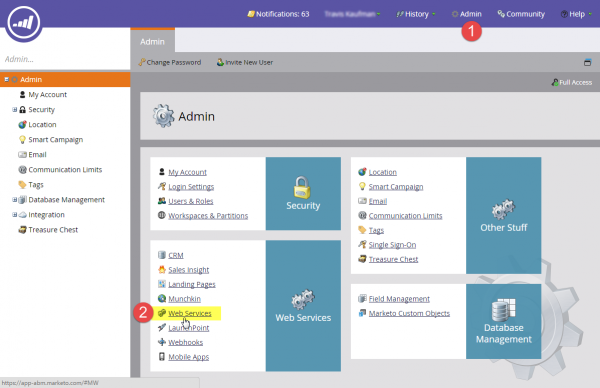

# API SOAP

L’API dell’SOAP è diventata obsoleta e non sarà più disponibile dopo il 31 ottobre 2025. Tutti i nuovi sviluppi devono essere eseguiti con Marketo [REST API](../rest-api/rest-api.md) e i servizi esistenti devono essere migrati entro tale data per evitare interruzioni del servizio. Se si dispone di un servizio che utilizza l&#39;API SOAP, consultare la [Guida alla migrazione dell&#39;API SOAP](./migration.md) per informazioni su come eseguire la migrazione.

## WSDL SOAP

Per recuperare il documento WSDL SOAP, ottenere l&#39;endpoint API SOAP dal menu **[!UICONTROL Admin]** > **[!UICONTROL Integration]** > **[!UICONTROL Web Services]**.

L&#39;URL WSDL è:

`<SOAP API Endpoint> + ?WSDL`

Non utilizzare il punto finale definito nel file WSDL. Ogni istanza di Marketo ha un endpoint univoco in cui effettuare chiamate a.

## Limiti

- **Quota giornaliera:** alla maggior parte degli abbonamenti sono assegnate 10.000 chiamate API al giorno (che vengono ripristinate ogni giorno alle 00.00 CST). Puoi aumentare la tua quota giornaliera tramite il tuo account manager.
- **Limite di frequenza:** accesso API per istanza limitato a 100 chiamate per 20 secondi.
- **Limite concorrenza:**  Massimo dieci chiamate API simultanee.

Si consiglia di non superare le 300 dimensioni del batch. Dimensioni maggiori non sono supportate e possono causare timeout e, in casi estremi, essere limitati.

## Impostazioni API SOAP in Marketo

1. Andare alla sezione **[!UICONTROL Admin]** e fare clic su **[!UICONTROL Web Services]**.

1. Imposta un [!UICONTROL Encryption Key] appropriato, fai clic su **[!UICONTROL Save Changes]** e utilizza i valori API SOAP [!UICONTROL Endpoint], [!UICONTROL User ID] e [!UICONTROL Encryption Key] per generare la [firma di autenticazione](authentication-signature.md) corretta per ogni chiamata API SOAP.

